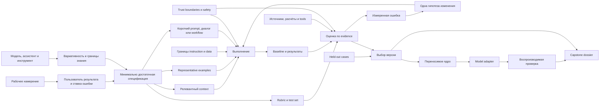

# Course Blueprint: Общий язык с ИИ

Версия: 1

Статус: проект курса проверен; делегированное создание курса активно

Дата проектирования: 2026-08-04

## Backward design от Capstone

Capstone требует спроектировать и доказательно улучшить реальную сложную
рабочую задачу. Чтобы представить полное досье, learner должен:

1. отделить возможности языковой модели от функций ассистента и инструментов,
   не принимая беглость или уверенность за гарантию;
2. превратить намерение в минимально достаточную спецификацию с наблюдаемой
   целью, пользователем результата, inputs, actions, constraints, format,
   uncertainties, criteria и verification;
3. выбрать релевантный context, representative examples и формат границ по их
   функции, затем проверить, не потерялось ли существенное условие;
4. выбрать короткий prompt, requirements interview или workflow по сложности,
   неизвестности и проверяемости подзадач;
5. задать rubric, normal, edge, adversarial и held-out cases, получить baseline
   и проверить существенную вариативность;
6. связать claims с источниками, расчётами, tests или human judgment, не
   подменяя проверку generated citation или вердиктом второй модели;
7. проверить trust boundaries, чувствительные данные, bias, IP и точные
   последствия возможного внешнего действия;
8. изменить минимум две измеренные ошибки по одной содержательной гипотезе за
   итерацию и показать, что held-out evidence не использовалось для подгонки;
9. сохранить переносимое ядро спецификации отдельно от model adapter и
   воспроизводимо зафиксировать условия эксперимента;
10. сравнить итог с Self-Assessment rubric, назвать границы и выбрать следующую
    проверку без ложного objective score.

Capstone context выбирает learner, но brief требует realistic stakes, нового
контекста относительно учебного кейса и результата, который можно проверить за
четыре часа. Если исходная задача содержит секреты, лишние персональные данные
или требует медицинского, юридического либо финансового решения, learner
обезличивает, сужает или заменяет её до начала работы.

Итоговый artefact — единое досье: intent, specification, prompt/workflow,
context package, rubric, test set, baseline, selected outputs, iteration log,
external evidence, safety check, reproducibility record и limitations. Именно
эти observable parts определяют dependency order Modules; тематический список
сам по себе не определяет архитектуру Course.

## Concept map и prerequisite dependencies

Текстовая интерпретация: intent становится спецификацией только после
уточнения пользователя результата, ставки ошибки и границ системы.
Specification определяет режим работы, context, examples и критерии.
Execution даёт baseline, который оценивается по rubric и внешнему evidence.
Измеренная ошибка порождает одну проверяемую гипотезу и новый запуск. Held-out
cases выбирают версию после разработки. Для переноса specification отделяется
от model adapter, а условия запуска фиксируются в reproducibility record.

Prerequisite order:

- границы модели, ассистента и tools вводятся до обещаний о качестве и до
  выбора prompting technique;
- пользователь результата и ставка ошибки предшествуют criteria, safety depth
  и выбору режима работы;
- specification предшествует context selection, examples, decomposition и
  rubric, иначе learner оптимизирует незафиксированную цель;
- релевантность и trust boundary вводятся до работы с длинным или найденным
  content;
- workflow создаётся только после различения простой и сложной задачи;
- baseline и test set фиксируются до первой целевой итерации;
- Deterministic Check и внешний evidence вводятся до AI critique и
  self-correction;
- prompt injection, privacy и external-action confirmation повторяются при
  каждом новом источнике или инструменте, а не добавляются в конце;
- metaprompt candidates создаются после criteria и development cases;
- held-out cases не используются до финального выбора версии;
- model adapter появляется только после переносимого ядра specification;
- Capstone получает новый context после убывания Instructional Scaffolding.

## Почему пять Modules

Architecture содержит пять Modules, потому что Capstone требует пяти крупных
промежуточных capabilities:

1. построить спецификацию, понимая границы системы;
2. превратить specification в управляемый context и workflow;
3. измерить качество и улучшить конкретное отклонение;
4. подтвердить claims и удержать safety boundaries;
5. использовать metaprompting и перенос без подгонки под один output или model.

Каждая capability завершается самостоятельным Module Checkpoint и становится
входом следующей. Объединение Modules 3 и 4 перегружает одну capability двумя
разными вопросами — «как измерить?» и «какому evidence доверять?». Разделение
Modules 1 или 2 на тематические главы увеличивает число Checkpoints, но не даёт
новой intermediate capability. Пять Modules покрывают 30 Lessons по 35 минут,
пять интеграционных Checkpoints и четырёхчасовой Capstone внутри budget 26
часов 15 минут.

## Sequence

### Module 1. От намерения к спецификации (`ot-namereniya-k-specifikacii`)

Intermediate capability: объяснить границы системы, превратить рабочее
намерение в минимально достаточную спецификацию и выбрать подходящий режим
работы.

| Order | Lesson slug | Lesson | Primary capability | Outcomes | Study | Practice | Advanced |
| ---: | --- | --- | --- | --- | ---: | ---: | ---: |
| 1 | `model-assistent-i-instrument` | Модель, ассистент или инструмент | Определять, какая часть системы генерирует текст, хранит context, вызывает tool и выполняет действие | `distinguish-system-boundaries` | 14 | 21 | 0 |
| 2 | `pravdopodobnyy-tekst-i-proverennyy-rezultat` | Беглый ответ ещё не факт | Отличать model output от проверенного факта и результата внешнего инструмента | `distinguish-system-boundaries`, `verify-evidence` | 14 | 21 | 0 |
| 3 | `variativnost-i-povtornye-zapuski` | Один prompt — не один гарантированный ответ | Планировать несколько cases и runs, когда вариативность способна изменить решение | `distinguish-system-boundaries`, `evaluate-quality` | 14 | 21 | 10 |
| 4 | `tokeny-i-kontekstnoe-okno` | Поместилось в окно — не значит использовалось | Объяснять token и context limits без английских эвристик и проверять потерянные условия | `distinguish-system-boundaries`, `design-inputs` | 14 | 21 | 10 |
| 5 | `ierarhiya-instrukciy` | Не все инструкции имеют одинаковый приоритет | Читать instruction hierarchy как contract конкретной системы и различать trusted instruction и quoted data | `distinguish-system-boundaries`, `manage-risk` | 14 | 21 | 10 |
| 6 | `karta-specifikacii-zadachi` | Из намерения — в проверяемую задачу | Собирать цель, пользователя результата, inputs, actions, constraints, format, uncertainties, criteria и verification | `specify-work` | 14 | 21 | 0 |
| 7 | `minimalno-dostatochnaya-detalizaciya` | Длиннее не значит точнее | Удалять роль, повтор или context, который не меняет решение, границу, формат или проверку | `specify-work`, `design-inputs` | 14 | 21 | 0 |
| 8 | `zapros-dialog-ili-workflow` | Один запрос, диалог или workflow | Выбирать режим по числу неизвестных, сложности, tools и промежуточной проверяемости | `specify-work`, `orchestrate-work` | 14 | 21 | 0 |

Module Checkpoint, 50 минут: learner получает сырой запрос «подготовь план
запуска курса». Он отмечает границы ассистента и модели, называет ставку
ошибки, превращает запрос в минимально достаточную specification, удаляет
декоративную роль, выбирает prompt, requirements interview или workflow и
задаёт способ проверки. Changed case просит подготовить решение для
руководителя при неполных данных. Evidence: mode объяснён наблюдаемыми
признаками, а уверенный текст не считается фактом.

### Module 2. Контекст и проверяемый workflow (`kontekst-i-workflow`)

Intermediate capability: собрать релевантный input package и спроектировать
workflow, в котором каждый шаг даёт проверяемый artefact.

| Order | Lesson slug | Lesson | Primary capability | Outcomes | Study | Practice | Advanced |
| ---: | --- | --- | --- | --- | ---: | ---: | ---: |
| 1 | `byudzhet-relevantnosti` | Контекст платит за место вниманием | Отбирать сведения, которые меняют действие или критерий, и удалять отвлекающий context | `design-inputs`, `specify-work` | 14 | 21 | 0 |
| 2 | `poteryannye-usloviya-v-dlinnom-kontekste` | Найди условие, которое модель пропустила | Перестраивать input и test cases, чтобы обнаруживать потерю существенных условий | `design-inputs`, `evaluate-quality` | 14 | 21 | 10 |
| 3 | `primery-i-granichnye-sluchai` | Пример показывает поведение, а не закон | Подбирать representative normal и edge examples и добавлять контрпример только к измеренной ошибке | `design-inputs`, `evaluate-quality` | 14 | 21 | 10 |
| 4 | `format-dlya-sleduyushchego-potrebitelya` | Markdown, теги или JSON | Выбирать форму по границам частей и следующему потребителю без обещания semantic correctness | `design-inputs`, `distinguish-system-boundaries` | 14 | 21 | 10 |
| 5 | `dialog-kak-intervyu-o-trebovaniyah` | Сначала выяснить, потом собрать заново | Проводить requirements interview и подтверждать консолидированную specification до выполнения | `orchestrate-work`, `specify-work` | 14 | 21 | 5 |
| 6 | `dekompoziciya-s-usloviem-prodolzheniya` | Каждый шаг должен оставить evidence | Делить задачу на более простые подзадачи с проверяемым output и stop/go condition | `orchestrate-work`, `verify-evidence` | 14 | 21 | 10 |

Module Checkpoint, 50 минут: по specification запуска образовательного продукта
learner получает набор заметок, таблицу требований, три examples и недоверенный
фрагмент web research. Он отбирает context, выбирает representative examples,
разделяет instruction и data, проводит короткое интервью по неизвестному,
консолидирует результат и строит workflow с artefact и условием продолжения
после каждого шага. Evidence: лишняя деталь удалена, embedded instruction не
получает authority, а decomposition уменьшает сложность.

### Module 3. Измерение и управляемое улучшение (`izmerenie-i-uluchshenie`)

Intermediate capability: зафиксировать baseline, измерить качество на
representative cases и улучшить одну диагностированную ошибку.

| Order | Lesson slug | Lesson | Primary capability | Outcomes | Study | Practice | Advanced |
| ---: | --- | --- | --- | --- | ---: | ---: | ---: |
| 1 | `rubrika-i-cena-oshibki` | Качество состоит из нескольких измерений | Строить rubric из observable properties, приоритетов и цены критической ошибки | `evaluate-quality`, `manage-risk` | 14 | 21 | 0 |
| 2 | `normal-edge-adversarial-i-held-out` | Один удачный пример ничего не доказывает | Собирать development и held-out test sets из normal, edge и adversarial cases | `evaluate-quality` | 14 | 21 | 10 |
| 3 | `tochnaya-proverka-ili-samoocenka` | Где нужен тест, а где rubric | Выбирать Deterministic Check, human calibration или Self-Assessment без ложного score | `evaluate-quality`, `verify-evidence` | 14 | 21 | 10 |
| 4 | `baseline-i-variativnye-zapuski` | Сначала измерь исходный результат | Фиксировать baseline и достаточное число cases/runs до изменения prompt | `evaluate-quality`, `distinguish-system-boundaries` | 14 | 21 | 5 |
| 5 | `izmerennaya-oshibka-i-odna-gipoteza` | Меняй только то, что проверяешь | Связывать одно содержательное изменение с измеренным failure и вести iteration log | `evaluate-quality`, `improve-and-transfer` | 14 | 21 | 10 |
| 6 | `vneshnee-svidetelstvo-vmesto-samokritiki` | «Проверь себя» — ещё не проверка | Сравнивать intrinsic self-critique с feedback от source, test, calculation или calibrated human rubric | `verify-evidence`, `improve-and-transfer` | 14 | 21 | 10 |

Module Checkpoint, 55 минут: learner получает specification, prompt и четыре
outputs для анонса образовательного продукта. Он строит rubric, разделяет
development и held-out cases, выбирает deterministic и open checks, фиксирует
baseline, диагностирует failure, меняет одну гипотезу и проверяет новую версию.
AI critique используется для списка возможных причин, но версия выбирается по
evidence. Checkpoint возвращает context selection и workflow из Modules 1–2.

### Module 4. Источники, инструменты и безопасность (`evidence-i-bezopasnost`)

Intermediate capability: получить достаточное внешнее evidence и безопасно
работать с недоверенными данными, чувствительной информацией и действиями.

| Order | Lesson slug | Lesson | Primary capability | Outcomes | Study | Practice | Advanced |
| ---: | --- | --- | --- | --- | ---: | ---: | ---: |
| 1 | `prompt-istochnik-vychislenie-ili-tool` | Выбери правильную опору | Выбирать поиск для current fact, source для claim, calculation для точного ответа и tool contract для действия | `verify-evidence`, `distinguish-system-boundaries` | 14 | 21 | 0 |
| 2 | `proverka-istochnika-i-citacii` | Ссылка должна поддерживать тезис | Проверять authority, date, applicability и соседний supporting fragment каждой существенной citation | `verify-evidence`, `evaluate-quality` | 14 | 21 | 10 |
| 3 | `neizvestnost-i-granicy-vyvoda` | Не заполняй пробел уверенным текстом | Формулировать допустимую uncertainty и выбирать следующую проверку при недостатке evidence | `verify-evidence`, `manage-risk` | 14 | 21 | 0 |
| 4 | `prompt-injection-kak-granica-doveriya` | Документ может содержать враждебную инструкцию | Отделять trusted instruction от untrusted content и не считать delimiter защитой | `manage-risk`, `design-inputs` | 14 | 21 | 10 |
| 5 | `privatnost-predvzyatost-i-prava` | Какие данные и чьи интересы затрагивает ответ | Минимизировать sensitive data и проверять bias, IP и product-specific data policy | `manage-risk` | 14 | 21 | 10 |
| 6 | `vneshnie-deystviya-i-stavka-oshibki` | Проверь target до необратимого действия | Масштабировать verification и подтверждать точный target, параметры и последствия | `manage-risk`, `verify-evidence`, `orchestrate-work` | 14 | 21 | 0 |

Module Checkpoint, 50 минут: learner проверяет research pack для решения о
запуске продукта. В pack есть актуальный claim без даты, вымышленная citation,
скрытая инструкция в документе, персональные данные участника и draft внешнего
письма. Learner выбирает tool/evidence для каждого claim, проверяет supporting
fragment, обозначает неизвестное, обезличивает данные и составляет confirmation
card для внешнего действия. Rubric и test cases из Module 3 используются
повторно.

### Module 5. Метапромптинг и перенос (`metaprompting-i-perenos`)

Intermediate capability: использовать модель для интервью и генерации
кандидатов, выбирать версию по held-out evidence и переносить specification
отдельно от model adapter.

| Order | Lesson slug | Lesson | Primary capability | Outcomes | Study | Practice | Advanced |
| ---: | --- | --- | --- | --- | ---: | ---: | ---: |
| 1 | `metaprompt-kak-intervyuer` | Модель помогает найти пробел, но не назначает цель | Проводить pipeline interview → draft specification → gap analysis, сохраняя цель, risk и criteria у человека | `improve-and-transfer`, `specify-work` | 14 | 21 | 10 |
| 2 | `kandidaty-i-otlozhennaya-proverka` | Генерируй несколько, выбирай по тестам | Создавать prompt candidates и отбирать их на held-out cases без переобучения на development set | `improve-and-transfer`, `evaluate-quality` | 14 | 21 | 20 |
| 3 | `russkiy-angliyskiy-odin-test` | Язык сравнивают, а не объявляют победителем | Сравнивать русскую и английскую versions на одном test set и диагностировать изменение смысла при переводе | `improve-and-transfer`, `design-inputs` | 14 | 21 | 25 |
| 4 | `perenosimoe-yadro-i-adapter-modeli` | Переноси задачу, а не магическую строку | Отделять specification от roles, parameters и tool syntax, затем фиксировать воспроизводимый model adapter | `improve-and-transfer`, `distinguish-system-boundaries` | 14 | 21 | 35 |

Module Checkpoint, 50 минут: learner проходит полный metaprompt pipeline для
новой рабочей задачи, получает минимум три candidates, выбирает версию по
development evidence и проверяет на held-out cases. Затем отделяет portable
specification от adapter текущей модели. Optional extension повторяет один
test set на второй модели или сравнивает русский и английский без изменения
criteria. Evidence фиксирует model, date, tools, full input, outputs и rubric.

### Capstone Demonstration

Время: 240 минут.

Milestones:

1. **Безопасный brief, 20 минут.** Learner выбирает новую реальную задачу,
   называет пользователя результата, stakes, exclusions и обезличивает inputs.
2. **Specification, 35 минут.** Собирает обязательные поля и обосновывает
   удалённые детали.
3. **Mode и input package, 30 минут.** Выбирает prompt/dialog/workflow,
   подготавливает context, examples, boundaries и stop/go conditions.
4. **Evaluation design, 35 минут.** Создаёт rubric, development cases и
   untouched held-out cases; выбирает deterministic checks.
5. **Baseline, 25 минут.** Фиксирует условия запуска и baseline outputs без
   выбора одного красивого ответа.
6. **Две итерации, 55 минут.** Для каждой версии называет failure, одну
   hypothesis, изменение и evidence результата.
7. **Evidence и safety, 20 минут.** Проверяет consequential claims, citations,
   prompt injection, privacy, bias, IP и external actions.
8. **Held-out selection, 10 минут.** Выбирает итоговую версию на неиспользованных
   cases и отмечает regression.
9. **Self-Assessment и limits, 10 минут.** Сверяет dossier с rubric, называет
   uncertainty и следующую проверку.

Capstone rubric:

| Criterion | Observable evidence | Outcomes |
| --- | --- | --- |
| Границы системы учтены | Model output не назван выполненным действием или проверенным фактом; variability, context и instruction hierarchy учтены там, где меняют решение | `distinguish-system-boundaries` |
| Specification минимально достаточна | Цель, пользователь, inputs, actions, constraints, format, uncertainties, criteria и verification наблюдаемы; retained fields меняют решение, границу, формат или проверку | `specify-work` |
| Inputs спроектированы по функции | Context релевантен, examples покрывают normal/edge behavior, instruction и data разделены, потерянные условия проверены | `design-inputs` |
| Режим и workflow обоснованы | Prompt, interview или workflow выбран по неизвестности и сложности; каждый шаг даёт artefact и stop/go condition | `orchestrate-work` |
| Качество измеряется, а не угадывается | Есть multidimensional rubric, development и held-out cases, baseline, достаточные runs и сравнение без ложного objective score | `evaluate-quality` |
| Claims связаны с evidence | Существенные тезисы поддержаны точным source fragment, calculation, Deterministic Check или явно calibrated human judgment | `verify-evidence` |
| Риск управляется пропорционально ставке | Untrusted content, privacy, bias, IP и external action проверены; target и последствия подтверждены до действия | `manage-risk` |
| Улучшение и перенос доказаны | Каждая iteration отвечает на measured failure; held-out cases не использованы для подгонки; portable specification отделена от model adapter | `improve-and-transfer` |

Likely failure modes:

- prompt становится длиннее, но ни одна новая деталь не связана с criterion;
- один удачный output подменяет baseline и representative test set;
- development cases незаметно становятся held-out cases;
- AI critique или second-model verdict объявляются объективной оценкой;
- generated citation есть в списке, но не поддерживает соседний claim;
- untrusted document меняет instructions или предлагает external action;
- journal перечисляет edits, но не связывает их с measured failures;
- model adapter смешан со specification, поэтому перенос меняет цель;
- Self-Assessment превращается в score или certification claim.

Extensions: optional second-model comparison, Russian/English comparison on
identical cases, expanded adversarial set или human calibration. Ни одно
extension не требуется для core evidence.

## Outcome Alignment

| Outcome | Instruction | Practice | Module Checkpoints | Capstone criterion |
| --- | --- | --- | --- | --- |
| `distinguish-system-boundaries` | Lessons 1–5 Module 1; retrieval в format, tool boundary и model adapter Lessons | разобрать system diagram, классифицировать outputs, спланировать repeated runs и instruction priority | Modules 1, 2, 4 и 5 | Границы системы учтены |
| `specify-work` | Lessons 6–8 Module 1; requirements interview Module 2; metaprompt interview Module 5 | переписать vague intent, заполнить и сократить specification, объяснить retained fields | Modules 1, 2 и 5 | Specification минимально достаточна |
| `design-inputs` | context, examples и format Lessons Module 2; prompt injection Module 4; language comparison Module 5 | context ablation, example selection, lost-condition probe, instruction/data separation | Modules 1, 2, 4 и 5 | Inputs спроектированы по функции |
| `orchestrate-work` | mode selection Module 1; interview и decomposition Module 2; external action Module 4 | выбрать mode, консолидировать dialogue, задать artefact и stop/go condition | Modules 1, 2 и 4 | Режим и workflow обоснованы |
| `evaluate-quality` | весь Module 3; examples Module 2; source verification Module 4; candidate selection Module 5 | rubric, normal/edge/adversarial cases, baseline, multiple runs, held-out selection | Modules 1–5 | Качество измеряется, а не угадывается |
| `verify-evidence` | external feedback Module 3; Lessons 1–3 Module 4 | выбрать search/source/calculation/tool, проверить citation fragment, обозначить uncertainty | Modules 2, 3 и 4 | Claims связаны с evidence |
| `manage-risk` | instruction hierarchy Module 1; rubric stakes Module 3; Lessons 3–6 Module 4 | найти injection, минимизировать data, проверить bias/IP, составить confirmation card | Modules 1, 3 и 4 | Риск управляется пропорционально ставке |
| `improve-and-transfer` | iteration Lessons Module 3; весь Module 5 | iteration log, external feedback, metaprompt candidates, held-out selection, model adapter | Modules 3 и 5 | Улучшение и перенос доказаны |

Нет Learning Outcome только с recall evidence. Каждый Outcome получает
причинное explanation, meaningful Practice Task, возврат в более позднем
context, минимум один Module Checkpoint и отдельный observable Capstone
criterion.

## Knowledge Check plan

| Pattern | Placement | Диагностируемая ошибка |
| --- | --- | --- |
| `matching` | `model-assistent-i-instrument` | текстовая генерация, хранение history и external action приписаны одной модели |
| `single` | `pravdopodobnyy-tekst-i-proverennyy-rezultat` | уверенность или citation count приняты за factual verification |
| `multiple` | `variativnost-i-povtornye-zapuski` | один run используется для high-variance decision |
| `matching` | `tokeny-i-kontekstnoe-okno` | context capacity смешана с гарантированным вниманием и русским token count |
| `ordering` | `karta-specifikacii-zadachi` | format выбирается до цели и пользователя результата |
| `single` | `zapros-dialog-ili-workflow` | сложность mode определяется длиной prompt, а не неизвестностью и checks |
| `multiple` | `byudzhet-relevantnosti` | context добавлен потому, что доступен, а не потому, что меняет решение |
| `matching` | `format-dlya-sleduyushchego-potrebitelya` | Markdown, XML-like blocks и JSON получают магические свойства |
| `ordering` | `dialog-kak-intervyu-o-trebovaniyah` | выполнение начинается до consolidation и confirmation |
| `multiple` | `rubrika-i-cena-oshibki` | rubric сводится к «хорошо написано» или одному average score |
| `matching` | `normal-edge-adversarial-i-held-out` | development, edge, adversarial и held-out roles смешаны |
| `single` | `tochnaya-proverka-ili-samoocenka` | open-ended quality объявлена deterministic truth |
| `ordering` | `izmerennaya-oshibka-i-odna-gipoteza` | несколько изменений внесены до фиксации failure и baseline |
| `matching` | `prompt-istochnik-vychislenie-ili-tool` | current fact, calculation, claim и action проверяются одним способом |
| `multiple` | `proverka-istochnika-i-citacii` | URL существует, но source/date/applicability/fragment не проверены |
| `single` | `prompt-injection-kak-granica-doveriya` | delimiter принят за полную защиту от untrusted instruction |
| `ordering` | `vneshnie-deystviya-i-stavka-oshibki` | external action выполнен до target review и explicit confirmation |
| `multiple` | `kandidaty-i-otlozhennaya-proverka` | held-out cases используются для редактирования candidate |
| `matching` | `perenosimoe-yadro-i-adapter-modeli` | цель и criteria смешаны с roles, parameters и tool syntax |

Checks появляются рядом с concept, допускают retry и объясняют признак,
причину и следующее действие. Они не создают cumulative score и не определяют
Lesson Completion.

## Instructional Scaffolding

1. Readiness Check активирует опыт learner на знакомом short prompt и указывает
   только конкретные prerequisite gaps.
2. Module 1 использует полный worked example «запуск образовательного
   продукта»: raw request → system boundary map → specification → mode choice.
   Learner сначала отмечает parts, затем сам сокращает specification и решает
   changed case.
3. Module 2 сохраняет готовую specification, но снимает готовый input package.
   Worked context ablation сменяется partial example selection, затем learner
   самостоятельно строит consolidated interview и workflow.
4. Module 3 даёт worked rubric и baseline только в первых Lessons. В Reference
   Lesson learner получает outputs и measured failure, но сам выбирает одну
   hypothesis, заполняет iteration log и объясняет evidence. Последний Lesson
   убирает готовый verification method.
5. Module 4 меняет surface context: research pack содержит mixed-trust sources,
   injection и data risks. Learner больше не получает готовый список проверок,
   а выбирает evidence и verification depth по stakes.
6. Module 5 предоставляет только pipeline и acceptance criteria. Learner сам
   управляет metaprompt interview, candidates, dev/held-out split и model
   adapter. Optional second model не получает отдельного worked answer.
7. Каждый Module Checkpoint использует changed case, возвращает прежние
   capabilities и даёт diagnostic review guidance, но не блокирует следующий
   Module.
8. Capstone меняет рабочую задачу, убирает готовые prompts/examples и оставляет
   brief, milestones, constraints и Self-Assessment rubric.

Support fades так: annotated worked example → marked parts → partial
completion → changed-case choice → independent workflow → new-task Capstone.
Hints становятся progressively specific и раскрываются после первой попытки.
Worked solutions показывают причины шагов, промежуточные checks и границы, а
не только красивый final output.

## Cumulative Retrieval

- Lesson 2 Module 1 возвращает границы model/assistant/tool из Lesson 1 через
  классификацию evidence.
- Lessons 3–5 Module 1 требуют заново различать capacity, variability и
  instruction authority на changed cases.
- Module 1 Checkpoint объединяет system boundaries, specification и mode.
- `byudzhet-relevantnosti` начинает с сокращения specification из Module 1.
- `dialog-kak-intervyu-o-trebovaniyah` возвращает все поля specification без
  готового списка в прежнем порядке.
- Module 2 Checkpoint требует system boundary, minimal specification и mode
  before workflow.
- `rubrika-i-cena-oshibki` извлекает пользователя результата и stakes из
  Module 1.
- `normal-edge-adversarial-i-held-out` возвращает representative examples из
  Module 2, но меняет их роль с teaching examples на evaluation cases.
- `baseline-i-variativnye-zapuski` возвращает variability из Module 1.
- Module 3 Checkpoint повторно использует specification, context и workflow.
- `prompt-istochnik-vychislenie-ili-tool` возвращает model/tool boundary;
  `prompt-injection-kak-granica-doveriya` возвращает instruction hierarchy и
  context boundaries.
- Module 4 Checkpoint требует rubric, test cases и iteration evidence из
  Module 3 вместе с safety checks.
- `metaprompt-kak-intervyuer` возвращает requirements interview, но learner
  проверяет, не присвоила ли модель цель и acceptable risk.
- `kandidaty-i-otlozhennaya-proverka` возвращает baseline, iteration log и
  held-out split без готового example set.
- `russkiy-angliyskiy-odin-test` возвращает format sensitivity и test-set
  invariance.
- `perenosimoe-yadro-i-adapter-modeli` возвращает все system boundaries,
  specification и reproducibility fields.
- Module 5 Checkpoint и Capstone требуют все Outcomes в новых contexts без
  копирования сквозного case.

Интервалы растут: immediate recall внутри Lesson → Module Checkpoint → reuse в
следующем Module → mixed-trust changed case → independent Capstone. Retrieval
меняет surface features и требует выбора, а не повторяет формулировку.

## Explanation plan

| Difficult concept | Learner need and concrete case | Causal or decision model | Necessary terms | Boundary and likely misconception |
| --- | --- | --- | --- | --- |
| Модель, ассистент и tool | Понять, кто написал, кто помнит history и кто отправил письмо | layered system: model proposes text/call; assistant supplies context/policy; tool executes | модель, ассистент, tool contract | «Модель отправила письмо»; interfaces differ by provider |
| Вероятностная генерация | Объяснить разные drafts по одному request | prompt + model state → distribution of possible continuations → sampled output | variability, run, baseline | temperature 0 не доказывает truth или exact repeatability |
| Tokens и context | Решить, что включить в длинный document pack | capacity limits placement; relevance and position affect usable evidence | token, context window, relevance budget | «Поместилось» не значит «условие использовано»; English token heuristic не переносится на русский |
| Instruction hierarchy | Не дать quoted document изменить задачу | authority follows system contract and source, not visual formatting | instruction, data, priority, untrusted content | hierarchy provider-specific; model compliance is not absolute defense |
| Specification | Сделать vague «подготовь запуск» наблюдаемой задачей | intent + result user + inputs/actions/constraints + criteria/verification → executable brief | specification, criterion, uncertainty | это diagnostic map, не обязательный maximal template |
| Минимальная детализация | Сократить длинный role-heavy prompt | detail earns place only if it changes decision, boundary, format or check | ablation, relevant detail | shorter is not always better; length alone is not quality |
| Выбор mode | Не сжимать неизвестную complex task в one-shot | low uncertainty/simple verification → prompt; unknown requirements → interview; dependent checked steps → workflow | requirements interview, workflow, stop/go condition | decomposition adds failure points when subtasks are not simpler |
| Context and examples | Выбрать inputs для launch plan | task distribution → representative normal/edge cases; controlled order/format experiment | few-shot, edge case, counterexample | universal example count/order does not exist |
| Markdown, XML-like blocks, JSON | Передать human-readable parts или machine contract | next consumer determines structure; structure validity and semantic truth are separate | delimiter, JSON, structured output | format can influence output but is not truth or injection protection |
| Rubric and test set | Отличить attractive copy from fit-for-purpose result | dimensions + observable evidence + error cost; dev cases improve, held-out cases select | rubric, adversarial, held-out | one score hides trade-offs; open work has no deterministic truth by default |
| Baseline and iteration | Узнать, какое edit helped | fixed test set + baseline → measured failure → one hypothesis → rerun → compare | baseline, iteration log, regression | simultaneous edits break causal diagnosis |
| Self-critique and external feedback | Исправить unsupported claim | critique generates hypotheses; source/test/calculation supplies new evidence | intrinsic self-correction, external feedback | second model verdict is not objective truth |
| Claim verification | Проверить generated citation | claim → exact supporting fragment → authority/date/applicability → bounded conclusion | claim, citation, provenance | URL existence or citation count does not support claim |
| Prompt injection | Read uploaded research safely | trusted instruction and untrusted data remain separate across processing; external action needs confirmation | indirect prompt injection, trust boundary | delimiters reduce ambiguity but cannot guarantee defense |
| Privacy, bias and external actions | Не причинить hidden harm | minimize data; inspect affected people and rights; scale checks by stakes; confirm target | sensitive data, bias, IP, irreversible action | generic checkbox or provider policy copied across products is insufficient |
| Metaprompting | Получить candidates without surrendering goal | human owns intent/risk/criteria; model interviews and proposes; eval selects | metaprompt, candidate, development set | confident candidate or train-set winner can overfit |
| Russian/English and model transfer | Перенести working process without myth | hold specification/tests constant; vary language or adapter; measure differences | portable core, model adapter, reproducibility | English is not universal winner; prompt text need not transfer verbatim |

Each explanation follows Course Voice and the plain-Russian research: name the
real decision early, introduce only prerequisite parts, show one worked case
with reasons and intermediate checks, contrast a nearby failure, state the
boundary, then elicit a changed-case action before consolidation. Diagrams are
used only for layered system, central cycle, trust boundary or iteration loop
when they reduce effort; exact mappings use Markdown tables.

## Reference Lesson calibration plan

Selected Reference Lesson:
`modules/izmerenie-i-uluchshenie/lessons/izmerennaya-oshibka-i-odna-gipoteza.mdx`.

Почему Lesson репрезентативен:

- находится в середине dependency chain и возвращает specification, context,
  examples, rubric, test cases, variability и baseline;
- выражает центральный переход Course `оценка → уточнение`;
- требует причинного понимания, а не копирования prompt template;
- использует сквозной кейс запуска образовательного продукта и changed
  professional case для transfer;
- позволяет откалибровать Knowledge Check, open Practice Task, progressive
  hints, TaskRubric и Reflection без AI grading;
- показывает diagnostic feedback: measured symptom → likely cause → one change
  → rerun → regression check;
- проверяет natural Russian вокруг терминов baseline, failure, hypothesis и
  iteration log;
- visual decision содержательна: компактный iteration table обязателен;
  Diagram добавляется только если learner-probe покажет, что causal loop
  трудно восстановить из текста.

Planned calibration:

- depth: learner объясняет, почему simultaneous edits не позволяют приписать
  improvement одной cause, и распознаёт случай, где controlled isolation
  невозможно;
- pacing: 14 минут study + 21 минута core practice + до 10 минут advanced;
- worked example: baseline launch brief fails on audience specificity and
  unsupported claims; author changes only evidence rule, then compares same
  cases;
- partial completion: learner получает rubric, baseline outputs и one failure,
  но сам формулирует hypothesis and log entry;
- independent transfer: для changed case learner выбирает measured failure and
  one change без готового prompt;
- interaction density: один diagnostic Knowledge Check, одна core Practice
  Task с progressive hints и TaskRubric, одна Reflection only if stored note
  helps plan next iteration;
- feedback: names observable symptom, why tempting multi-edit strategy breaks
  diagnosis, correction and next rerun;
- accessibility: iteration comparison remains understandable as text/table and
  never encodes winner only with color or position;
- source use: causal claim about controlled iteration is framed as Course
  design method; variability and eval claims cite Evidence Base sources near
  learner-facing text;
- comprehension probe: representative learner retells the loop without source
  wording, chooses one change in a changed case and explains what evidence
  would falsify it. «Всё понятно?» is not accepted evidence.

Reference Lesson ticket #70 records probe method, observed errors, corrections
and final calibration in a new Blueprint version or calibration addendum. Until
that work exists, only selection and planned contract are complete; no claim of
target-learner validation is made.

## Coverage audit

- Outcome gap audit: all eight Outcomes have instruction, meaningful practice,
  later retrieval, Module Checkpoint evidence and one separate Capstone
  criterion.
- Capstone-backward audit: every required dossier part is prepared by a Module;
  no Module exists only because it appeared in the former eight-topic research
  hypothesis.
- Dependency audit: specification precedes context/workflow; rubric and
  baseline precede iteration; evaluation precedes source/safety integration;
  held-out selection precedes portability claim.
- Module capability audit: each Module ends in one usable intermediate
  capability, not a recap of unrelated topics.
- Lesson load audit: 30 Lessons each target one primary capability and 35 core
  minutes. Tokens/context and instruction hierarchy are separate Lessons;
  privacy/bias/IP stay together because their primary action is affected-data
  and rights review.
- Duplication audit: variability, specification, rubric and trust boundary
  recur only as Cumulative Retrieval in harder contexts. Tool boundary is
  introduced in Module 1 and operationalized with evidence in Module 4.
- Myth audit: role expertise, longest prompt, temperature 0, full attention to
  a large window, guaranteed self-correction, citation/JSON truth, XML injection
  protection and universal English superiority each receive a causal
  correction and changed-case test.
- Evidence audit: stable claims map to Evidence Base; conflicting role and
  self-correction results retain boundaries; provider-specific rules stay in
  dated labs/adapters.
- Russian audit: core explanation is Russian; retained English serves official
  names, exact identifiers or terms needed for interface/search. Translation
  experiments hold cases and criteria constant.
- Practice audit: every Lesson elicits action before solution; every Module
  Checkpoint is cumulative, changed-case and non-blocking; Capstone is a new
  authentic task.
- Scaffolding audit: complete worked path appears only early; support falls
  through partial completion and independent selection to new-task Capstone.
- Safety audit: verification, prompt injection, privacy, bias, IP and external
  action appear both in dedicated instruction and across later practice.
- Accessibility audit: planned visuals have text equivalents; tables carry
  exact comparisons; no learning meaning depends on color, motion or audio.
- Offline audit: External References are supplemental; authored summaries,
  cases, criteria and expected evidence keep core path self-contained.
- Platform audit: no new schema, component, layout, script, style, runtime,
  evaluator, storage or Capability Pack is assumed.
- Scope audit: deep research, image generation, agent engineering, programming,
  medical/legal/financial decisions and autonomous external actions remain
  excluded.
- Workload audit: five capability-based Modules, 30 Lessons, five Checkpoints,
  Readiness Check and Capstone total 26 hours 15 minutes; optional work is four
  additional hours.

No unresolved Critical Decision blocks Reference Lesson authoring. Living
provider claims, learner-probe evidence and final freshness dates remain
explicit later-ticket checks, not silent assumptions.

## Workload

| Part | Core minutes | Optional minutes |
| --- | ---: | ---: |
| Optional, non-blocking Readiness Check | 30 | 0 |
| Module 1: eight Lessons | 280 | 30 |
| Module 1 Checkpoint | 50 | 0 |
| Module 2: six Lessons | 210 | 45 |
| Module 2 Checkpoint | 50 | 0 |
| Module 3: six Lessons | 210 | 45 |
| Module 3 Checkpoint | 55 | 0 |
| Module 4: six Lessons | 210 | 30 |
| Module 4 Checkpoint | 50 | 0 |
| Module 5: four Lessons | 140 | 90 |
| Module 5 Checkpoint | 50 | 0 |
| Capstone Demonstration | 240 | 0 |
| **Total** | **1575** | **240** |

Core: 26 часов 15 минут. Optional advanced: до 4 часов. Каждый Lesson занимает
35 минут core, включая study и learner action. Checkpoints получают 50–55
минут на интеграцию, а Capstone — 4 часа независимой работы. При темпе около
3–3,5 часа в неделю основной маршрут укладывается примерно в восемь недель.

Workload определяет пять Modules вместе с capability dependencies. Увеличение
числа Modules добавило бы новые Checkpoints без нового Capstone evidence;
уменьшение смешало бы distinct intermediate capabilities и превысило бы
разумную нагрузку одного Module.

## Verification record

- Brief version 1 завершён до проектирования Sequence и фиксирует отсутствие
  blocking Critical Decisions.
- Parent spec #68, Evidence Base 2026-08-04, plain-language research и current
  authoring contract использованы как design inputs.
- Backward trace выполнен от восьми Capstone criteria к Module Checkpoints,
  Practice and instruction; gaps в Outcome Alignment не найдены.
- Dependency, overload, duplication, scope, platform, safety, accessibility и
  workload audits записаны выше.
- Reference Lesson выбран из середины Course; calibration evidence ещё должно
  быть получено в ticket #70 и не заявлено как завершённое.
- Blueprint не публикует Course и не вводит platform contract. Draft остаётся
  вне `src/content/courses` до полного integration ticket.

Материальное изменение Module capabilities, Outcome evidence, Capstone,
Reference Lesson или workload требует новой версии Blueprint и повторной
проверки Outcome Alignment.
