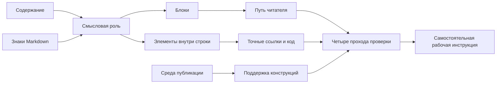

# Course Blueprint: Основы Markdown

Версия: 2

Статус: одобрен Course Owner

Дата фиксации: 2026-07-25

## Backward design от Capstone

Capstone требует самостоятельно создать и проверить рабочую инструкцию. Значит, до него learner должен:

1. объяснять, какую роль разметка добавляет содержанию;
2. читать исходник как блоки и элементы внутри строк;
3. проектировать путь читателя через заголовки и списки;
4. записывать ссылки и код без догадок;
5. фиксировать среду и проверять критичные расширения;
6. проводить воспроизводимую редакторскую проверку.

## Concept map и dependencies

Prerequisite order:

- модель разметки предшествует выбору синтаксиса;
- чтение блоков предшествует проектированию иерархии;
- базовые ссылки и код предшествуют проверке расширений;
- среда и support boundary предшествуют финальной проверке;
- все четыре capabilities интегрируются в Capstone.

## Sequence

| Module / Lesson | Primary capability | Outcomes | Study | Practice | Advanced |
| --- | --- | --- | ---: | ---: | ---: |
| 1. От исходника к структуре | Читать исходник и предсказывать структуру | `explain-markup` |  |  |  |
| Знакомство с Markdown | Отделять содержание, разметку и представление | `explain-markup` | 8 | 7 | 0 |
| Как читать Markdown-исходник | Различать блоки и элементы внутри строки | `explain-markup` | 10 | 10 | 0 |
| 2. Структура рабочей инструкции | Создавать путь читателя с однозначными ресурсами | `structure-document`, `connect-resources` |  |  |  |
| Заголовки, выделение и списки | Проектировать иерархию и последовательность | `structure-document` | 10 | 10 | 0 |
| Ссылки и код | Записывать ресурсы и точные команды | `connect-resources` | 8 | 7 | 0 |
| 3. Проверка и переносимость | Обосновывать готовность в названной среде | все |  |  |  |
| Где Markdown перестаёт быть одинаковым | Проверять support boundary | `connect-resources`, `review-portability` | 12 | 13 | 5 |
| Проверка инструкции перед публикацией | Проводить четыре прохода | все | 10 | 15 | 5 |

Module Checkpoints:

- Module 1: объяснить путь от исходника к структурированному документу;
- Module 2: собрать памятку перед выпуском с ясной структурой, ссылкой и командой;
- Module 3: исправить документ и обосновать каждое изменение.

Capstone: самостоятельная инструкция на 350–700 слов, журнал проверки, Self-Assessment по четырём outcomes.

## Outcome Alignment

| Outcome | Instruction | Practice | Module Checkpoint | Capstone criterion |
| --- | --- | --- | --- | --- |
| `explain-markup` | `vvedenie`, `source-render`, `review` | «Отдели содержание от разметки», «Разметь карту исходника», финальная проверка | Module 1 и cumulative Module 3 | Выбор разметки объяснён через смысловую роль |
| `structure-document` | `formatting`, `review` | «Собери структуру заметки», «Проверь инструкцию без готового ответа» | Module 2 и cumulative Module 3 | Инструкция ведёт читателя через ясную иерархию |
| `connect-resources` | `links-code`, `portability`, `review` | «Убери догадки из шага», «Выбери переносимую запись» | Module 2 и cumulative Module 3 | Ссылки и команды записаны однозначно |
| `review-portability` | `portability`, `review` | две проверки support boundary и четыре прохода | Module 3 | Среда названа, критичные конструкции проверены |

Нет outcome только с recall evidence: каждый taught, practiced, integrated by Module Checkpoint и demonstrated by observable Capstone criterion.

## Knowledge Check plan

| Pattern | Placement | Диагностируемая ошибка |
| --- | --- | --- |
| `single` | Course Readiness, `vvedenie` | Требование лишнего инструмента; смешение разметки с сервисом |
| `matching` | `source-render` | Смешение блока и элемента внутри строки |
| `ordering` | `formatting`, `portability` | Проверка без контекста или преждевременный выбор синтаксиса |
| `multiple` | `links-code` | Пропуск текста или адреса ссылки |
| `exact` | `portability` | Неумение назвать базовую спецификацию |
| `single` | `review` | Подмена целевой среды средой предварительного просмотра |

Каждый check не влияет на completion, допускает retry и объясняет governing idea.

## Instructional Scaffolding

1. `vvedenie`: worked distinction между содержанием и разметкой.
2. `source-render`: guided two-pass model + частичный разбор.
3. `formatting`: worked syntax + learner restructures given prose.
4. `links-code`: learner исправляет локальную неоднозначность с reasoned solution.
5. `portability`: changed context требует выбрать переносимую запись.
6. `review`: open work с Self-Assessment, готового решения нет.
7. Module 3 Checkpoint и Capstone: independent integration; подсказки описывают процесс, не готовый документ.

Поддержка уменьшается от конкретного worked reasoning к критериям и самостоятельному обоснованию.

## Cumulative Retrieval

- Module 1 Checkpoint возвращает модель «блоки → элементы внутри строк».
- `formatting` требует читать блоки, освоенные в Module 1.
- `links-code` возвращает distinction between content and inline markup.
- `portability` повторно использует заголовки, списки, ссылки и код в новой среде.
- `review` объединяет все прежние capabilities в четырёх проходах.
- Module 3 Checkpoint требует исправить source without changing factual sequence.
- Capstone retrieves all outcomes without повторения исходных примеров.

Интервалы растут: immediate Lesson checks → end-of-Module integration → changed-context Module 3 → independent Capstone.

## Reference Lesson calibration record

Reference Lesson: `modules/struktura/lessons/formatting.mdx`

Calibration date: 2026-07-25

Decision basis: canonical implementation scope in issue #23

Approval evidence: Course Owner явно одобрил Blueprint и Reference Lesson
2026-07-25 сообщением «Одобряю» после передачи реализации issue #23 в commit
`58e7b48832aa4cbeaafe3d32169072816eff8534`.

Accepted calibration:

- depth: объясняет не только синтаксис, но и выбор между иерархией и визуальным эффектом;
- pacing: 10 минут study + 10 минут practice;
- voice: разговорное `ты`, точные термины, ошибки описываются как свойства решения;
- examples: короткая рабочая заметка, не искусственный набор символов;
- interactions: один local recognition check, один ordering transfer check, одна Practice Task и Reflection;
- visual balance: обычный код и текст достаточны; декоративная Learning Visual не добавляется;
- feedback: неправильные варианты соответствуют вероятным misconceptions;
- scaffolding: объяснение → ordering → guided rewrite → personal Reflection.

Эта калибровка применяется к остальным Lessons: одна primary capability, полная
Learning Cycle, interaction only where thinking changes.

## Coverage audit

- Gap audit: все outcomes имеют instruction, practice, checkpoint и Capstone evidence.
- Dependency audit: ни одно расширение не используется до объяснения base/extension boundary.
- Duplication audit: синтаксис повторяется только внутри changed contexts; определения не копируются.
- Overload audit: каждый Lesson 15–35 минут вместе с advanced time.
- Unnecessary material: изображения, HTML, footnotes и editor setup исключены.
- Visual audit: Diagram объясняет transformation relationship; Chart поддерживает чтение review evidence; exact comparison remains a Markdown table.
- Component audit: все base component families используются по learning function, не как gallery.

## Workload

| Part | Minutes |
| --- | ---: |
| Six Lessons | 130 |
| Three Module Checkpoints | 60 |
| Capstone Demonstration | 45 |
| Optional advanced time included in Lessons | 10 |
| Total | 235 |
