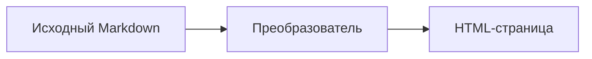

## Что такое Markdown

Markdown — это лёгкий язык разметки. В обычный текст добавляются простые знаки, которые описывают его структуру: `#` обозначает заголовок, а `*` может выделить слово.

Исходный текст остаётся читаемым даже до преобразования в HTML или другой формат. Поэтому Markdown удобно использовать для заметок, документации и учебных материалов.

<Callout kind="key">
  Разметка описывает роль фрагмента текста, а не его точный внешний вид.
</Callout>

<Diagram
  title="Как Markdown становится страницей"
  description="Исходный Markdown проходит через преобразователь и становится HTML-страницей."
  howToRead="Читай схему слева направо: от файла с разметкой к готовой странице."
  takeaway="Markdown хранит структуру отдельно от оформления."
>



</Diagram>

<KnowledgeCheck
  prompt="Какое преимущество Markdown особенно полезно при работе с исходным текстом?"
  options={["Он остаётся читаемым без специального редактора", "Он требует подключения базы данных", "Он автоматически переводит текст"]}
  answer="Он остаётся читаемым без специального редактора"
  explanation="Символы Markdown просты, поэтому структуру документа видно прямо в исходном тексте."
/>

## Первый документ

Создай файл `notes.md` и добавь строку:

```md
# Мои заметки
```

Расширение `.md` подсказывает инструментам, что файл содержит Markdown.
