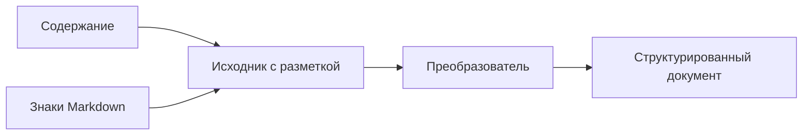

Представь инструкцию из двадцати строк. В текстовом редакторе всё выглядит терпимо, но после публикации читатель не различает название, шаги и предупреждение. Markdown решает не задачу «сделать красивее», а задачу «обозначить роль частей текста».

## Три слоя одного документа

У документа есть:

1. **содержание** — слова, которые читает человек;
2. **разметка** — знаки, обозначающие роль фрагмента;
3. **представление** — то, как выбранная система показывает эту роль.

Markdown — это лёгкий язык разметки. В обычный текст добавляются простые знаки, которые описывают его структуру: `#` обозначает заголовок, а `*` может выделить слово.

Исходный текст остаётся читаемым до преобразования в HTML или другой формат. Спецификация CommonMark описывает документ как последовательность блоков — например, абзацев, заголовков, списков и блоков кода — с элементами внутри строк, включая ссылки, выделение и код. См. [раздел «Blocks and inlines» спецификации CommonMark 0.31.2](https://spec.commonmark.org/0.31.2/#blocks-and-inlines).

<Callout kind="key">
  Разметка описывает роль фрагмента текста, а не его точный внешний вид.
</Callout>

<Diagram
  title="Как Markdown становится страницей"
  description="Содержание и знаки Markdown образуют исходник, который преобразователь превращает в структурированный документ."
  howToRead="Читай схему слева направо: сначала содержание соединяется с разметкой, затем исходник проходит через преобразователь."
  takeaway="Markdown хранит структуру отдельно от оформления."
>


```mermaid
flowchart LR
  meaning["Содержание"] --> source["Исходник с разметкой"]
  markup["Знаки Markdown"] --> source
  source --> transformer["Преобразователь"]
  transformer --> page["Структурированный документ"]
```

</Diagram>

<KnowledgeCheck
  type="single"
  prompt="Какое преимущество Markdown особенно полезно при работе с исходным текстом?"
  outcomes={["explain-markup"]}
  options={[
    {
      id: "readable-source",
      text: "Он остаётся читаемым без специального редактора",
      feedback: "Да: простые символы Markdown показывают структуру прямо в исходном тексте.",
    },
    {
      id: "requires-database",
      text: "Он требует подключения базы данных",
      feedback: "База данных для Markdown не нужна: разметка хранится в обычном текстовом файле.",
    },
    {
      id: "automatic-translation",
      text: "Он автоматически переводит текст",
      feedback: "Markdown описывает структуру текста, но не переводит его на другой язык.",
    },
  ]}
  answer="readable-source"
  explanation="Символы Markdown просты, поэтому структуру документа видно прямо в исходном тексте."
/>

## Первый документ

Создай файл `notes.md` и добавь строку:

```md
# Мои заметки
```

Расширение `.md` подсказывает инструментам, что файл содержит Markdown.

<PracticeTask
  title="Отдели содержание от разметки"
  level="core"
  estimatedMinutes={7}
  goal="Объяснить, какую роль знак Markdown добавляет обычному тексту"
  outcomes={["explain-markup"]}
  criteria={[
    "Названо содержание строки",
    "Названа роль знака #",
    "Объяснение не привязано к цвету или размеру",
  ]}
>
  Сравни строки `План выпуска` и `# План выпуска`. Объясни двумя предложениями,
  что осталось прежним и что добавила разметка.

  <TaskSolution
    reasoning="Слова «План выпуска» остались содержанием. Символ # в начале второй строки обозначил, что эта строка играет роль заголовка первого уровня; конкретное оформление выберет среда публикации."
    alternatives={["Можно описать разницу через читателя: во второй строке он получает структурный ориентир, а не только текст."]}
    likelyErrors={["Утверждать, что # обязательно делает текст крупным и синим.", "Считать # частью содержания, которое должен прочитать человек."]}
  />
</PracticeTask>
