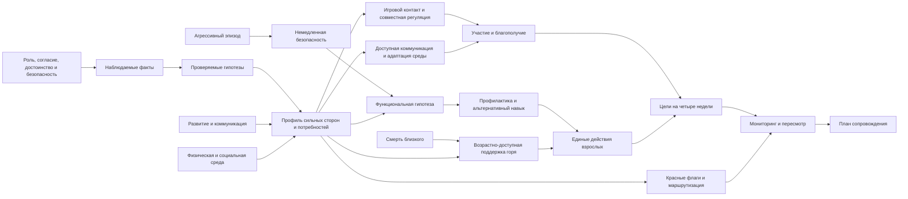

# Course Blueprint: Психологическая помощь дошкольникам

Версия: 1

Статус: одобрен Course Owner 2026-07-30

Дата проектирования: 2026-07-30

## Backward design от Capstone

Capstone требует составить безопасный план сопровождения ребёнка на четыре
недели по новому комплексному случаю. Чтобы выполнить его, learner должен:

1. удерживать границы роли психолога, согласие, доступное ребёнку объяснение и
   правила конфиденциальности;
2. отделять наблюдаемые факты от интерпретаций, диагностических ярлыков и
   проверяемых гипотез;
3. собирать профиль сильных сторон, коммуникации, регуляции, участия,
   семейного контекста и среды;
4. устанавливать контакт и адаптировать игру, коммуникацию, совместную
   регуляцию и среду к развитию ребёнка;
5. безопасно реагировать на агрессивный эпизод, анализировать его функцию и
   планировать профилактику и альтернативный навык;
6. применять единый алгоритм к разным профилям при аутизме, СДВГ, синдроме
   Дауна и ТНР, не заменяя им профильного специалиста;
7. поддерживать дошкольника после смерти близкого без принуждения,
   эвфемизмов и автоматической патологизации горя;
8. формулировать наблюдаемые цели на четыре недели, распределять действия
   между взрослыми и выбирать минимально достаточные показатели динамики;
9. распознавать медицинские, психиатрические, логопедические, кризисные и
   защитные границы, после которых нужна консультация или маршрутизация.

Capstone context — вымышленный случай пятилетнего ребёнка с установленной
особенностью развития, недавней смертью родителя, изменениями сна и участия,
эпизодами агрессии при переходах между занятиями и неодинаковой реакцией
взрослых. Case намеренно содержит несколько возможных объяснений. Learner не
должен связывать агрессию только с диагнозом или утратой: он обозначает
неизвестное, проверяет боль, коммуникацию, требования, среду, последствия
поведения и доступность поддержки.

Итоговый artefact — краткая формулировка случая, профиль потребностей, цели,
план контакта и адаптаций, safety/behaviour support plan, первичная поддержка
горя, распределение действий, мониторинг и критерии пересмотра или передачи
случая.

## Concept map и prerequisite dependencies

Prerequisite order:

- профессиональные границы и безопасность предшествуют любому анализу или
  вмешательству;
- факт отделяется от интерпретации до построения профиля потребностей;
- профиль предшествует выбору игры, визуальной поддержки или изменения среды;
- во время агрессивного эпизода безопасность предшествует анализу функции;
- функциональная гипотеза предшествует профилактическому plan и обучению
  альтернативному навыку;
- общий алгоритм изучается до condition-specific cases, чтобы диагноз не стал
  шаблоном;
- базовая модель развития и коммуникации предшествует помощи при утрате;
- цели формулируются только после профиля, а мониторинг — после выбора цели и
  меры поддержки.

Безопасность, достоинство ребёнка, участие семьи и границы компетенции —
сквозные constraints, а не отдельные действия в конце плана.

## Sequence

### Module 1. От запроса к профилю потребностей (`profil-potrebnostey`)

Intermediate capability: безопасно собрать исходные данные, отделить факты от
гипотез и определить границу собственной роли.

| Order | Lesson slug | Lesson | Primary capability | Outcomes | Study | Practice | Advanced |
| ---: | --- | --- | --- | --- | ---: | ---: | ---: |
| 1 | `granicy-roli-i-soglasie` | Роль психолога, согласие и голос ребёнка | Определять допустимое действие психолога по роли, согласию и ситуации безопасности | `collaborate-with-adults`, `monitor-and-refer` | 12 | 18 | 0 |
| 2 | `fakty-gipotezy-i-diagnoz` | Факт, гипотеза или диагноз | Переписывать оценочный ярлык в наблюдаемое описание и проверяемую гипотезу | `assess-needs` | 15 | 20 | 10 |
| 3 | `profil-silnyh-storon-i-potrebnostey` | Ребёнок больше списка трудностей | Составлять профиль сильных сторон, коммуникации, регуляции, участия и среды | `assess-needs`, `adapt-support` | 14 | 21 | 10 |
| 4 | `krasnye-flagi-i-marshrutizaciya` | Когда психологу нужна команда | Выбирать срочный или плановый маршрут по наблюдаемым признакам и границам компетенции | `monitor-and-refer`, `collaborate-with-adults` | 15 | 20 | 10 |

Module Checkpoint, 35 минут: по первичному обращению семьи и двум заметкам
взрослых отделить факты от выводов, составить начальный профиль, назвать
недостающие данные, получить требуемое согласие, предложить две первые
adaptations и выбрать безопасный следующий шаг. Evidence: ни один диагноз не
выводится из одного поведения; support связан с профилем, а маршрут — с
конкретным признаком.

### Module 2. Контакт, коммуникация и регуляция (`kontakt-i-regulyaciya`)

Intermediate capability: адаптировать взаимодействие и среду так, чтобы
ребёнок мог понимать, отвечать, регулироваться и участвовать.

| Order | Lesson slug | Lesson | Primary capability | Outcomes | Study | Practice | Advanced |
| ---: | --- | --- | --- | --- | ---: | ---: | ---: |
| 1 | `igrovoy-kontakt-i-soglasie-rebenka` | Контакт начинается не с требования | Устанавливать игровой контакт, замечая инициативу, отказ и доступный темп ребёнка | `adapt-support`, `assess-needs` | 12 | 18 | 0 |
| 2 | `dostupnaya-kommunikaciya` | Когда речь — не единственный ответ | Давать понятную инструкцию и принимать жест, изображение, предмет или AAC как коммуникацию | `adapt-support`, `collaborate-with-adults` | 14 | 21 | 10 |
| 3 | `sovmestnaya-regulyaciya` | Сначала вместе, потом самостоятельно | Подбирать совместную регуляцию по состоянию и сигналам ребёнка | `adapt-support`, `assess-needs` | 14 | 21 | 10 |
| 4 | `predskazuemaya-i-dostupnaya-sreda` | Среда тоже участвует в поведении | Изменять требования, последовательность, сенсорную нагрузку и предсказуемость без снижения достоинства | `adapt-support`, `collaborate-with-adults` | 13 | 22 | 10 |

Module Checkpoint, 35 минут: адаптировать встречу для ребёнка, который мало
использует речь, избегает шумной комнаты и прекращает игру при непредсказуемом
переходе. Evidence: минимум одна мера меняет коммуникацию, одна — среду, одна
— поддержку взрослого; каждая связана с наблюдением, а не с предположением о
«нежелании».

### Module 3. Агрессивное поведение: безопасность и функция (`agressivnoe-povedenie`)

Intermediate capability: защитить участников, понять возможную функцию
агрессивного поведения и согласовать профилактический behaviour support plan.

| Order | Lesson slug | Lesson | Primary capability | Outcomes | Study | Practice | Advanced |
| ---: | --- | --- | --- | --- | ---: | ---: | ---: |
| 1 | `bezopasnost-vo-vremya-epizoda` | Что делать в момент агрессии | Выбирать последовательность неограничительных действий для немедленной безопасности | `respond-to-aggression`, `monitor-and-refer` | 14 | 21 | 0 |
| 2 | `ot-epizoda-k-funkcionalnoy-gipoteze` | Что произошло до, во время и после | Строить проверяемую функциональную гипотезу по наблюдаемой последовательности | `respond-to-aggression`, `assess-needs` | 14 | 21 | 10 |
| 3 | `profilaktika-i-alternativnyy-navyk` | Не только остановить, но и научить | Связывать профилактическое изменение и альтернативный навык с предполагаемой функцией поведения | `respond-to-aggression`, `adapt-support` | 13 | 22 | 10 |
| 4 | `edinyy-plan-vzroslyh` | Один ребёнок — не пять разных правил | Согласовывать действия до, во время и после эпизода дома и в детском саду | `respond-to-aggression`, `collaborate-with-adults`, `monitor-and-refer` | 14 | 21 | 10 |

Module Checkpoint, 40 минут: разобрать два эпизода — удар сверстника из-за
предмета и удар взрослого при завершении занятия. Learner составляет
immediate safety sequence, ABC-описание, две проверяемые гипотезы,
профилактику, альтернативные способы попросить предмет или паузу, способ
измерить изменение и критерий командного пересмотра. Evidence не объявляет
функцию доказанной по одному эпизоду.

### Module 4. Разные профили — общий алгоритм (`osobennosti-razvitiya-v-kejsah`)

Intermediate capability: переносить общий алгоритм на случаи аутизма, СДВГ,
синдрома Дауна и ТНР, учитывая неоднородность и роль других специалистов.

| Order | Lesson slug | Lesson | Primary capability | Outcomes | Study | Practice | Advanced |
| ---: | --- | --- | --- | --- | ---: | ---: | ---: |
| 1 | `autizm-i-individualnyy-profil` | Аутизм: профиль важнее шаблона | Связывать поддержку с коммуникацией, сенсорной средой, предсказуемостью и интересами конкретного ребёнка | `assess-needs`, `adapt-support` | 12 | 18 | 0 |
| 2 | `sdvg-regulyaciya-deyatelnosti` | СДВГ: поддержать управление деятельностью | Адаптировать длительность, переходы, движение, инструкцию и обратную связь без моральной оценки | `assess-needs`, `adapt-support`, `collaborate-with-adults` | 14 | 21 | 10 |
| 3 | `sindrom-dauna-razvitie-i-zdorove` | Синдром Дауна: развитие рядом со здоровьем | Отличать психологическую задачу от признаков, требующих проверки слуха, сна, боли или другого состояния здоровья | `assess-needs`, `adapt-support`, `monitor-and-refer` | 14 | 21 | 10 |
| 4 | `tnr-kommunikaciya-v-komande` | ТНР: доступная коммуникация в команде | Поддерживать участие ребёнка и согласовывать работу с логопедом, не присваивая логопедическую роль | `assess-needs`, `adapt-support`, `collaborate-with-adults`, `monitor-and-refer` | 13 | 22 | 10 |

Module Checkpoint, 35 минут: сравнить четыре коротких случая с внешне похожим
отказом от группового задания. Для каждого learner называет возможные
различия в коммуникации, регуляции, здоровье и среде; выбирает следующую
проверку, одну адаптацию и нужного партнёра. Evidence не переносит способность
или ограничение с диагноза на ребёнка автоматически.

### Module 5. Утрата близкого и горевание (`utrata-i-gorevanie`)

Intermediate capability: дать дошкольнику и его взрослым доступную первичную
поддержку после смерти близкого и распознать признаки более интенсивной помощи.

| Order | Lesson slug | Lesson | Primary capability | Outcomes | Study | Practice | Advanced |
| ---: | --- | --- | --- | --- | ---: | ---: | ---: |
| 1 | `kak-doshkolnik-ponimaet-smert` | Как дошкольник понимает смерть | Интерпретировать вопросы, повторение, игру и изменения поведения с учётом развития и контекста | `support-grief`, `assess-needs` | 12 | 18 | 0 |
| 2 | `razgovor-o-smerti-bez-evfemizmov` | Честный разговор доступными словами | Формулировать короткий правдивый ответ без пугающих подробностей и двусмысленных эвфемизмов | `support-grief`, `collaborate-with-adults` | 14 | 21 | 10 |
| 3 | `igra-ritualy-i-stabilnaya-zabota` | Игра, память и предсказуемая забота | Поддерживать выражение переживания через игру, выбор, ритуал памяти и стабильные routines | `support-grief`, `adapt-support`, `collaborate-with-adults` | 14 | 21 | 10 |
| 4 | `travmaticheskoe-gore-i-marshrut` | Когда обычной поддержки недостаточно | Выбирать плановую, срочную или защитную маршрутизацию по динамике, травматическим реакциям и безопасности | `support-grief`, `monitor-and-refer` | 13 | 22 | 10 |

Module Checkpoint, 35 минут: ответить на вопросы четырёхлетнего ребёнка после
смерти родителя, предложить стабильную поддержку дома и в детском саду,
исправить опасные эвфемизмы, определить наблюдение динамики и признаки
маршрутизации. Evidence допускает разные формы горевания и не требует от
ребёнка разговора или «правильной» эмоции.

### Module 6. План на четыре недели (`plan-soprovozhdeniya`)

Intermediate capability: превратить formulation в согласованный, измеримый и
пересматриваемый краткий цикл помощи.

| Order | Lesson slug | Lesson | Primary capability | Outcomes | Study | Practice | Advanced |
| ---: | --- | --- | --- | --- | ---: | ---: | ---: |
| 1 | `celi-na-chetyre-nedeli` | Цель, которую можно увидеть | Переписывать общую цель в наблюдаемое изменение участия, коммуникации или регуляции | `set-support-goals` | 12 | 18 | 0 |
| 2 | `plan-s-rebenkom-semey-i-sadom` | Кто, что и в какой ситуации делает | Распределять выполнимые действия ребёнка, семьи, педагогов, психолога и профильных специалистов | `set-support-goals`, `adapt-support`, `collaborate-with-adults` | 14 | 21 | 10 |
| 3 | `monitoring-bez-psevdotochnosti` | Минимальные данные для полезного решения | Выбирать простой baseline и показатель, который помогает пересмотреть поддержку | `set-support-goals`, `monitor-and-refer` | 14 | 21 | 10 |
| 4 | `peresmotr-plana-i-peredacha-sluchaya` | Продолжить, изменить или передать | Принимать решение по динамике, новым данным, безопасности и границам компетенции | `set-support-goals`, `collaborate-with-adults`, `monitor-and-refer` | 13 | 22 | 10 |

Module Checkpoint, 35 минут: собрать из готовой formulation краткий plan с
двумя наблюдаемыми целями, действиями в трёх средах, baseline, сроком review и
критериями изменения или маршрутизации. Evidence показывает, кто реально
выполнит каждое действие и как будет замечена польза или вред.

### Capstone Demonstration

Время: 170 минут.

Learner получает новый комплексный case и выполняет milestones:

1. отмечает согласие, доступное участие ребёнка, конфиденциальность и
   немедленные safety concerns;
2. разделяет факты, сообщения взрослых, интерпретации и неизвестное;
3. составляет профиль сильных сторон, коммуникации, регуляции, участия,
   семейных и средовых факторов;
4. формулирует 2–3 цели на четыре недели;
5. подбирает игровые, коммуникационные, регуляционные и средовые меры;
6. составляет safety/behaviour support plan для агрессивного поведения;
7. предлагает первичную поддержку горя дома и в детском саду;
8. распределяет действия между ребёнком, семьёй, педагогами, психологом и
   профильными специалистами;
9. задаёт baseline, способ наблюдения, дату review и варианты решения
   «продолжить / изменить / направить»;
10. проверяет весь artefact по Self-Assessment rubric и отмечает ограничения.

Capstone rubric:

| Criterion | Observable evidence | Outcomes |
| --- | --- | --- |
| Профиль основан на данных | Факты отделены от гипотез; названы сильные стороны, коммуникация, регуляция, участие, среда и недостающие данные | `assess-needs` |
| Цели наблюдаемы и ограничены сроком | Каждая цель описывает действие или участие ребёнка, ситуацию и признак изменения за четыре недели | `set-support-goals` |
| Поддержка индивидуализирована | Игра, коммуникация, совместная регуляция и среда связаны с профилем и не требуют нормативного поведения ради внешнего соответствия | `adapt-support` |
| Агрессия рассматривается безопасно и функционально | Есть immediate safety sequence, ABC-data, гипотеза, профилактика, альтернативный навык, согласованные реакции и критерий escalation | `respond-to-aggression` |
| Горю дана возрастно-доступная поддержка | Использованы правдивые слова, выбор, стабильная забота и допустимые способы выражения; названы признаки более интенсивной помощи | `support-grief` |
| Взрослые действуют согласованно | Роли, формулировки и действия семьи, педагогов, психолога и других специалистов конкретны и выполнимы | `collaborate-with-adults` |
| План измеряется и имеет границы | Есть baseline, минимальный показатель, review date, safety/red flags и основания продолжить, изменить или передать случай | `monitor-and-refer` |

## Outcome Alignment

| Outcome | Instruction | Practice | Module Checkpoints | Capstone criterion |
| --- | --- | --- | --- | --- |
| `assess-needs` | Module 1; profile building in Modules 2–5 | переписать ярлык, заполнить профиль, сравнить competing hypotheses | Modules 1, 2, 3, 4 и 5 | Профиль основан на данных |
| `set-support-goals` | весь Module 6 | исправить псевдоцели, сформулировать цель по changed case, связать её с baseline | Module 6 | Цели наблюдаемы и ограничены сроком |
| `adapt-support` | profile-to-support bridge in Module 1; Module 2; preventive support in Module 3; condition cases in Module 4; grief support in Module 5 | адаптировать встречу, коммуникацию, среду, альтернативный навык и ritual/routine | Modules 1, 2, 3, 4, 5 и 6 | Поддержка индивидуализирована |
| `respond-to-aggression` | весь Module 3 | safety ordering, ABC observation, functional hypothesis, prevention and alternative skill | Module 3 | Агрессия рассматривается безопасно и функционально |
| `support-grief` | весь Module 5 | исправить эвфемизм, подготовить разговор, выбрать поддержку, решить route | Module 5 | Горю дана возрастно-доступная поддержка |
| `collaborate-with-adults` | consent in Module 1; communication and environment in Module 2; shared behaviour plan in Module 3; team boundaries in Module 4; family support in Module 5; весь Module 6 | role-play transcript, common wording, distribution of actions, handoff note | Modules 1–6 | Взрослые действуют согласованно |
| `monitor-and-refer` | red flags in Module 1; safety review in Module 3; health and discipline boundaries in Module 4; grief route in Module 5; monitoring in Module 6 | choose urgency, define baseline, detect harm/no change, revise or refer | Modules 1, 3, 4, 5 и 6 | План измеряется и имеет границы |

Нет outcome только с recall evidence. Каждый outcome получает explanation,
meaningful Practice Task, интеграцию минимум в один Module Checkpoint и
отдельный наблюдаемый Capstone criterion.

## Knowledge Check plan

| Pattern | Placement | Диагностируемая ошибка |
| --- | --- | --- |
| `multiple` | `granicy-roli-i-soglasie` | смешение согласия взрослого, доступного участия ребёнка и экстренной безопасности |
| `matching` | `fakty-gipotezy-i-diagnoz` | смешение наблюдения, сообщения, интерпретации и диагноза |
| `multiple` | `profil-silnyh-storon-i-potrebnostey` | профиль состоит только из дефицитов |
| `single` | `krasnye-flagi-i-marshrutizaciya` | плановая работа там, где нужен срочный медицинский или защитный route |
| `ordering` | `igrovoy-kontakt-i-soglasie-rebenka` | требование задания до установления доступного контакта |
| `matching` | `dostupnaya-kommunikaciya` | речь ошибочно считается единственным валидным ответом |
| `single` | `sovmestnaya-regulyaciya` | требование самостоятельной регуляции в состоянии перегрузки |
| `multiple` | `predskazuemaya-i-dostupnaya-sreda` | вся причина поведения приписана ребёнку, среда не проверена |
| `ordering` | `bezopasnost-vo-vremya-epizoda` | анализ и нравоучение поставлены раньше прекращения непосредственного риска |
| `matching` | `ot-epizoda-k-funkcionalnoy-gipoteze` | antecedent, behaviour, consequence и function смешаны |
| `multiple` | `profilaktika-i-alternativnyy-navyk` | alternative skill недоступен или не выполняет ту же функцию |
| `single` | `edinyy-plan-vzroslyh` | взрослые непреднамеренно поддерживают цикл разными реакциями |
| `multiple` | Module 4 cases | одинаковый support plan выбран только по названию диагноза |
| `single` | `sindrom-dauna-razvitie-i-zdorove` | изменение поведения объяснено психологически без проверки боли, сна или слуха |
| `matching` | `tnr-kommunikaciya-v-komande` | психолог, логопед и дефектолог получают взаимозаменяемые роли |
| `single` | `kak-doshkolnik-ponimaet-smert` | повторный вопрос ребёнка ошибочно считается отсутствием горя или понимания |
| `multiple` | `razgovor-o-smerti-bez-evfemizmov` | эвфемизм создаёт страх сна, ухода или возвращения умершего |
| `single` | `travmaticheskoe-gore-i-marshrut` | любое горе патологизируется либо серьёзная реакция обесценивается |
| `matching` | `celi-na-chetyre-nedeli` | цель описывает удобство взрослого, метод или ненаблюдаемую черту |
| `ordering` | `peresmotr-plana-i-peredacha-sluchaya` | plan продолжается без review новых рисков и отсутствия пользы |

Checks дают explanatory feedback, unlimited retry, не создают score, не
диагностируют ребёнка и не заменяют Self-Assessment открытого reasoning.

## Instructional Scaffolding

1. Module 1 показывает worked transcript и цвето-независимую разметку
   «факт / источник / гипотеза / неизвестно», затем learner самостоятельно
   редактирует оценочную заметку.
2. Module 2 начинает с modelled play episode, затем оставляет learner выбрать
   темп, форму ответа и изменение среды по наблюдаемым сигналам.
3. Module 3 сначала даёт готовую safety sequence, затем частично заполненную
   ABC-table, после чего требует независимую functional hypothesis и behaviour
   support plan для changed case.
4. Module 4 меняет diagnoses и contexts при сохранении общего workflow.
   Подсказка «типичный профиль» постепенно заменяется вопросом «что известно
   об этом ребёнке и что ещё проверить».
5. Module 5 даёт worked wording разговора о смерти, затем learner исправляет
   опасные формулировки и создаёт поддержку для новой семейной ситуации.
6. Module 6 убирает готовую последовательность. Learner получает formulation,
   выбирает 2–3 цели, действия, baseline и review decision самостоятельно.
7. Module Checkpoints меняют поверхностные признаки и требуют интеграции
   нескольких Lessons; они не повторяют final Lesson.
8. Capstone объединяет особенность развития, утрату, агрессию и разные версии
   взрослых, но оставляет только brief, constraints, milestones и rubric.

Support fades: worked distinction → partial profile → independent adaptation
→ functional formulation → cross-condition transfer → integrated plan.

## Cumulative Retrieval

- Module 1 Checkpoint объединяет consent, neutral observation, profile и route.
- `igrovoy-kontakt-i-soglasie-rebenka` возвращает голос ребёнка и различение
  факта/интерпретации.
- Module 2 Checkpoint требует использовать profile template из Module 1.
- `bezopasnost-vo-vremya-epizoda` возвращает границы роли и urgent route.
- `ot-epizoda-k-funkcionalnoy-gipoteze` повторно использует neutral
  observation и competing hypotheses.
- Module 3 Checkpoint требует адаптаций коммуникации и среды из Module 2.
- Каждый Module 4 case возвращает один и тот же workflow: факт → профиль →
  адаптация → partner/route.
- Module 4 Checkpoint повторно использует aggression example, но меняет его
  возможные медицинские, коммуникационные и средовые факторы.
- `kak-doshkolnik-ponimaet-smert` требует отличать baseline ребёнка от нового
  изменения после утраты.
- Module 5 Checkpoint возвращает доступную коммуникацию, среду, consent и
  маршрутизацию.
- Module 6 превращает Practice artefacts Modules 1–5 в единый plan, но требует
  удалить лишние данные и оставить только decision-relevant evidence.
- Capstone меняет все имена и детали, сочетает ранее раздельные трудности и
  требует пересмотреть первую гипотезу после новых данных.

Интервалы растут: immediate discrimination → end-of-Module integration →
changed condition case → delayed planning reuse → independent Capstone.

## Reference Lesson calibration record

Предлагаемый Reference Lesson:
`modules/agressivnoe-povedenie/lessons/ot-epizoda-k-funkcionalnoy-gipoteze.mdx`.

Почему он репрезентативен:

- находится в середине dependency chain;
- соединяет нейтральное наблюдение, безопасность, causal reasoning,
  коммуникацию, среду и границы вывода;
- допускает worked example, deterministic Knowledge Check, open Practice Task
  с TaskRubric и Reflection по изменению профессиональной гипотезы;
- показывает Course Voice на эмоционально заряженной теме без обвинения
  ребёнка, семьи, педагога или learner;
- позволяет проверить Diagram последовательности, Markdown ABC-table,
  progressive hints и доступность длинного case description;
- ошибка в Lesson имеет реальное safety consequence, поэтому feedback должен
  объяснять ход reasoning, а не только правильный термин.

План калибровки:

- depth: learner строит гипотезу и называет данные для её проверки, но не
  проводит экспериментальную functional analysis и не ставит диагноз;
- pacing: 14 минут study + 21 минута practice + 10 минут optional;
- example: два внешне похожих удара с разными antecedents и consequences;
- interaction density: один matching Knowledge Check, одна open Practice Task,
  одна короткая Reflection;
- visual treatment: один Diagram «событие до → наблюдаемое действие →
  последствие → возможная функция» только для relationship; точные данные
  остаются в Markdown-table;
- feedback: различает описание, correlation, hypothesis и подтверждённый
  вывод;
- accessibility: полные текстовые alternatives, отсутствие зависимости от
  цвета, position или ability to speak;
- safety: reactive steps описываются как локально согласованный
  non-restrictive plan; Lesson не обучает физическому удержанию.

Reference Lesson создан:
`modules/agressivnoe-povedenie/lessons/ot-epizoda-k-funkcionalnoy-gipoteze.mdx`.

Course Owner явно одобрил Reference Lesson 2026-07-30 сообщением «да» как
эталон:

- depth: functional hypothesis строится из наблюдений, но не выдаётся за
  диагноз или доказанную причинность;
- pacing: 14 минут study + 21 минута practice + 10 минут optional;
- voice: уважительное `ты`; описывается действие и контекст, не «агрессивный
  ребёнок»;
- examples: одинаковое внешнее действие сопоставляется с разными antecedents
  и consequences;
- interactions: один matching Knowledge Check, одна open Practice Task с
  TaskRubric и одна Reflection;
- visual treatment: один Diagram показывает relationship, точные данные
  остаются в доступной Markdown-table;
- feedback: разделяет наблюдение, гипотезу, competing explanation и данные для
  проверки;
- scaffolding: worked example → сравнение эпизодов → самостоятельная ABC-table
  и formulation;
- safety: анализ начинается после прекращения риска, не учит физическому
  удержанию или опасной провокации.

Эта калибровка применяется к остальным Lessons. Материальное изменение depth,
voice, practice density, visual treatment или safety framing требует
повторного согласования.

## Coverage audit

- Gap audit: все семь outcomes имеют instruction, meaningful practice, Module
  Checkpoint evidence и отдельный Capstone criterion.
- Dependency audit: support не выбирается до profile; behaviour plan не
  выбирается до safety и functional hypothesis; диагнозные cases появляются
  после общего алгоритма; цели появляются после formulation.
- Scope audit: аутизм, СДВГ, синдром Дауна, ТНР, утрата и агрессия присутствуют
  в core route; сочетанный случай интегрируется в Capstone.
- Diagnosis audit: ни один condition-specific Lesson не является универсальным
  протоколом; неоднородность, coexisting conditions и missing data названы.
- Aggression safety audit: immediate safety, harm to others, possible pain,
  communication, environment, reinforcement, prevention, alternative skill,
  monitoring и escalation covered; punishment и untrained restraint excluded.
- Grief safety audit: развитие понятия смерти, truthful language, stable
  caregiving, choice, play, trauma interaction и route covered; forced
  disclosure и automatic diagnosis excluded.
- Role audit: medical diagnosis, medication, speech correction, long-term
  trauma therapy и restrictive practice training остаются exclusions.
- Duplication audit: profile, adaptation и route повторяются только в changed
  contexts как Cumulative Retrieval.
- Overload audit: каждый Lesson имеет одну primary capability и не больше 35
  core минут; four condition cases разделены по learner decision, не по полной
  теории расстройства.
- Assessment audit: deterministic checks оценивают только однозначные
  distinctions; case formulation и plan используют TaskRubric/Self-Assessment.
- Solvability audit: все cases вымышлены, содержат нужные данные и решаются без
  внешней ссылки или данных реального ребёнка.
- Accessibility audit: non-speaking communication признаётся валидной;
  visuals имеют текстовую alternative; tasks не требуют реакции на время.
- Source-risk audit: точные legal, clinical и safety claims подлежат
  line-by-line verification при authoring; отсутствие independent expert
  review остаётся publication limitation.
- Platform audit: Capability Packs, видео, аудио, AI diagnosis и automated
  evaluation открытых решений не заявлены.

## Workload

| Part | Core minutes | Optional minutes |
| --- | ---: | ---: |
| Module 1: four Lessons | 135 | 30 |
| Module 1 Checkpoint | 35 | 0 |
| Module 2: four Lessons | 135 | 30 |
| Module 2 Checkpoint | 35 | 0 |
| Module 3: four Lessons | 140 | 30 |
| Module 3 Checkpoint | 40 | 0 |
| Module 4: four Lessons | 135 | 30 |
| Module 4 Checkpoint | 35 | 0 |
| Module 5: four Lessons | 135 | 30 |
| Module 5 Checkpoint | 35 | 0 |
| Module 6: four Lessons | 135 | 30 |
| Module 6 Checkpoint | 35 | 0 |
| Capstone Demonstration | 170 | 0 |
| **Total** | **1200** | **180** |

Core: 20 часов. Optional advanced: до 3 часов. Каждый Lesson занимает 30–35
core минут; Module Checkpoints — 35–40 минут; Capstone — 170 минут с
milestones и возможностью сделать паузу между частями.

## Approval record

Course Owner явно одобрил Course Blueprint целиком 2026-07-30 сообщением «да».
Одобрение охватывает backward design, шесть Modules, 24 Lessons, шесть Module
Checkpoints, Capstone rubric, Outcome Alignment, scaffolding, Cumulative
Retrieval, Reference Lesson plan и workload 1200 + 180 минут.

Reference Lesson calibration одобрена Course Owner 2026-07-30. Материальное
изменение sequence, outcome evidence, Reference Lesson, Capstone или workload
требует новой версии Blueprint и повторного согласования.
