# Course Blueprint: Python для аналитика

Версия: 1

Статус: одобрен Course Owner

Дата проектирования: 2026-07-27

## Backward design от Capstone

Capstone требует ответить на аналитический вопрос по двум новым связанным
таблицам и передать воспроизводимый notebook. Значит, до него learner должен:

1. создать локальный `uv`-project и запускать notebook сверху вниз в чистом
   kernel;
2. читать минимальный Python-код и изменять выражения, коллекции, условия,
   циклы и небольшие функции;
3. объяснять модель NumPy array через `shape`, `dtype`, маски и оси;
4. диагностировать качество табличных данных до преобразований;
5. очищать данные с наблюдаемой проверкой до и после;
6. рассчитывать показатели, группировать, строить сводные таблицы и объединять
   источники с проверкой кардинальности;
7. выбирать график под вопрос и отделять вывод от предположения и ограничения;
8. перезапускать весь анализ и сохранять зависимости, данные и результаты,
   необходимые для воспроизведения.

Capstone context — синтетические обращения в службу поддержки. Learner
объединяет `requests.csv` и `teams.xlsx`, проверяет качество, рассчитывает время
обработки и признак превышения заданного SLA, сравнивает команды и каналы,
строит графики и формулирует рекомендации с ограничениями. SLA и другие пороги
заданы в dataset; Курс не выдаёт их за универсальные отраслевые нормы.

Dataset создаётся Course-provided deterministic bootstrap cell с фиксированным
seed. Cell сохраняет CSV/XLSX локально, после чего learner начинает новый
analysis notebook с чтения файлов. Значения не нужно переносить в код вручную,
внешний download и platform runtime не требуются.

## Concept map и dependencies

```mermaid
flowchart LR
  environment["uv project + locked dependencies"] --> notebook["Notebook и состояние kernel"]
  notebook --> python["Минимальный Python"]
  python --> numpy["NumPy: array, dtype, shape, axis"]
  numpy --> frame["pandas DataFrame"]
  source["CSV / XLSX"] --> frame
  frame --> quality["Типы, пропуски, дубликаты, ограничения"]
  quality --> clean["Проверяемая очистка"]
  clean --> transform["Фильтрация и вычисляемые признаки"]
  transform --> aggregate["GroupBy и pivot"]
  transform --> combine["Merge и проверка кардинальности"]
  aggregate --> evidence["Таблицы доказательств"]
  combine --> evidence
  evidence --> chart["График под аналитический вопрос"]
  chart --> findings["Выводы и ограничения"]
  notebook --> reproduce["Restart + Run All"]
  findings --> reproduce
  reproduce --> capstone["Воспроизводимый аналитический notebook"]
```

Prerequisite order:

- environment и kernel model предшествуют любой оцениваемой практике;
- минимальный Python предшествует NumPy;
- NumPy mental model предшествует объяснению векторных операций pandas;
- диагностика данных предшествует очистке и расчётам;
- вычисляемые признаки предшествуют группировке;
- ключи и кардинальность объясняются до `merge`;
- таблица evidence предшествует выбору графика;
- воспроизводимость возвращается после каждого крупного преобразования и
  интегрируется в финальное сообщение.

## Sequence

### Module 1. От таблицы к воспроизводимому коду (`vosproizvodimye-raschety`)

Intermediate capability: создать воспроизводимую локальную среду, читать
минимальный Python и выполнять векторизованные расчёты NumPy.

| Order | Lesson slug | Lesson | Primary capability | Outcomes | Study | Practice | Advanced |
| ---: | --- | --- | --- | --- | ---: | ---: | ---: |
| 1 | `setup-analysis-project` | Проект и notebook без магии | Создать `uv`-project, запустить JupyterLab и воспроизвести notebook в чистом kernel | `reproduce-analysis` | 14 | 21 | 10 |
| 2 | `python-values-collections` | Значения и коллекции вместо ячеек | Перевести знакомые табличные значения и диапазоны в выражения, переменные и коллекции Python | `calculate-with-arrays` | 17 | 18 | 0 |
| 3 | `python-decisions-functions` | Условия, повторения и небольшие функции | Читать и изменять условие, цикл и небольшую функцию внутри аналитического шага | `calculate-with-arrays`, `reproduce-analysis` | 17 | 18 | 0 |
| 4 | `numpy-array-model` | Как NumPy хранит набор чисел | Предсказывать результат операции по `shape`, `dtype` и индексации array | `calculate-with-arrays` | 17 | 18 | 10 |
| 5 | `numpy-vector-calculations` | Маски, оси и векторные расчёты | Рассчитывать показатели и проверки без ручного обхода каждого значения | `calculate-with-arrays` | 16 | 19 | 10 |

Module Checkpoint, 35 минут: восстановить notebook с нарушенным порядком ячеек,
объяснить тип и форму двух arrays, затем рассчитать выручку и отклонение по
маске и оси. Evidence: чистый повторный запуск и объяснение результата.

### Module 2. Подготовка данных в pandas (`podgotovka-dannyh`)

Intermediate capability: превратить CSV/XLSX в проверенный DataFrame и
обосновать каждое решение об очистке.

| Order | Lesson slug | Lesson | Primary capability | Outcomes | Study | Practice | Advanced |
| ---: | --- | --- | --- | --- | ---: | ---: | ---: |
| 1 | `load-and-inspect-data` | Загрузка и первый осмотр | Загрузить CSV/XLSX и проверить структуру, типы и диапазоны до анализа | `prepare-tabular-data`, `reproduce-analysis` | 14 | 21 | 15 |
| 2 | `diagnose-data-quality` | Типы, пропуски и дубликаты | Диагностировать проблему качества по наблюдаемому симптому, не исправляя данные вслепую | `prepare-tabular-data` | 16 | 19 | 5 |
| 3 | `clean-and-validate-data` | Очистка с доказательством | Очистить DataFrame и сравнить контрольные показатели до и после | `prepare-tabular-data`, `reproduce-analysis` | 14 | 21 | 5 |

Module Checkpoint, 30 минут: подготовить quality report для новой выгрузки
заказов, исправить только обоснованные проблемы и сохранить проверенный
результат. Evidence: исходные размеры, причины изменений, число затронутых
строк, контрольные ограничения после очистки.

### Module 3. Ответ через преобразования (`preobrazovanie-dannyh`)

Intermediate capability: преобразовать проверенные таблицы в проверяемый ответ
на аналитический вопрос.

| Order | Lesson slug | Lesson | Primary capability | Outcomes | Study | Practice | Advanced |
| ---: | --- | --- | --- | --- | ---: | ---: | ---: |
| 1 | `select-filter-calculate` | От вопроса к строкам и показателям | Выбрать наблюдения, преобразовать даты и рассчитать признаки без скрытого изменения исходника | `answer-with-transformations`, `prepare-tabular-data` | 14 | 21 | 10 |
| 2 | `group-and-pivot` | Сравнение групп и периодов | Получить проверяемое сравнение через `groupby`, агрегацию и pivot table | `answer-with-transformations`, `calculate-with-arrays` | 15 | 20 | 10 |
| 3 | `combine-and-check-tables` | Объединение без потерянных строк | Объединить таблицы по ключу и проверить кардинальность, совпадения и потери | `answer-with-transformations`, `prepare-tabular-data` | 16 | 19 | 20 |

Module Checkpoint, 35 минут: по таблицам заказов и категорий рассчитать
показатели по месяцу и региону, объединить справочник, найти изменение лидера
и доказать, что `merge` не размножил строки.

### Module 4. График, вывод и передача анализа (`vizualizaciya-i-vyvody`)

Intermediate capability: превратить проверенные результаты в понятное и
воспроизводимое аналитическое сообщение.

| Order | Lesson slug | Lesson | Primary capability | Outcomes | Study | Practice | Advanced |
| ---: | --- | --- | --- | --- | ---: | ---: | ---: |
| 1 | `choose-chart-for-question` | График начинается с вопроса | Выбрать базовый график по типу сравнения и структуре evidence table | `communicate-findings`, `answer-with-transformations` | 14 | 21 | 15 |
| 2 | `build-honest-chart` | Читаемый график без визуальных ловушек | Построить Matplotlib/Seaborn-график с ясными осями, единицами и доступным различением серий | `communicate-findings` | 14 | 21 | 0 |
| 3 | `state-findings-and-limits` | Вывод, предположение или ограничение | Связать каждый вывод с таблицей или графиком и передать notebook, выполняющийся сверху вниз | `communicate-findings`, `reproduce-analysis` | 15 | 20 | 10 |

Module Checkpoint, 30 минут: превратить готовую evidence table в короткое
аналитическое сообщение — график, два подтверждённых вывода, одно ограничение
и чистый повторный запуск.

### Capstone Demonstration

Время: 100 минут.

Learner получает два новых синтетических источника: обращения и справочник
команд. Требуется:

1. создать отдельный `uv`-project или синхронизировать Course project;
2. загрузить источники, зафиксировать форму, типы и проблемы качества;
3. очистить данные и показать контрольные показатели до и после;
4. объединить команды с обращениями, доказать ожидаемую кардинальность;
5. векторно рассчитать длительность и признак превышения заданного SLA;
6. сравнить команды, каналы и периоды через группировку или pivot;
7. построить минимум два графика для разных аналитических вопросов;
8. сформулировать выводы, ограничения и следующий проверяемый вопрос;
9. выполнить `Restart Kernel and Run All`, сохранить notebook и `uv.lock`.

Capstone rubric:

| Criterion | Observable evidence | Outcomes |
| --- | --- | --- |
| Анализ воспроизводится | Dependency lock сохранён; notebook выполняется сверху вниз без ручного восстановления скрытого состояния | `reproduce-analysis` |
| Векторный расчёт объяснён | NumPy operation использует подходящую маску или ось; learner объясняет влияние `shape` и `dtype` на результат | `calculate-with-arrays` |
| Качество данных контролируется | До расчётов показаны типы, пропуски и дубликаты; очистка сопровождается сравнением до/после | `prepare-tabular-data` |
| Преобразования отвечают на вопрос | Фильтры, признаки, группировки, pivot и merge образуют проверяемую цепочку без необъяснимой потери строк | `answer-with-transformations` |
| Выводы опираются на evidence | Графики имеют подписи и единицы; каждый вывод связан с результатом; предположения и ограничения названы отдельно | `communicate-findings` |

## Outcome Alignment

| Outcome | Instruction | Practice | Module Checkpoint | Capstone criterion |
| --- | --- | --- | --- | --- |
| `reproduce-analysis` | `setup-analysis-project`, `python-decisions-functions`, `load-and-inspect-data`, `clean-and-validate-data`, `state-findings-and-limits` | запуск чистого kernel, сохранение зависимостей, контрольные проверки после преобразований | Modules 1, 2 и 4 | Анализ воспроизводится |
| `calculate-with-arrays` | `python-values-collections`, `python-decisions-functions`, `numpy-array-model`, `numpy-vector-calculations`, retrieval в `group-and-pivot` | перевод табличной формулы, прогноз формы и типа, маски, осевые агрегации | Module 1 и cumulative Module 3 | Векторный расчёт объяснён |
| `prepare-tabular-data` | весь Module 2; retrieval в `select-filter-calculate` и `combine-and-check-tables` | диагностика, очистка, сравнение до/после, проверка merge | Module 2 и cumulative Module 3 | Качество данных контролируется |
| `answer-with-transformations` | весь Module 3; retrieval в `choose-chart-for-question` | фильтрация, признаки, даты, groupby, pivot, merge | Module 3 и cumulative Module 4 | Преобразования отвечают на вопрос |
| `communicate-findings` | весь Module 4 | выбор графика, исправление визуальной ловушки, evidence-linked prose | Module 4 | Выводы опираются на evidence |

Нет outcome только с recall evidence: каждый outcome taught, practiced,
интегрируется в Module Checkpoint и демонстрируется отдельным наблюдаемым
Capstone criterion.

## Knowledge Check plan

| Pattern | Placement | Диагностируемая ошибка |
| --- | --- | --- |
| `ordering` | `setup-analysis-project` | запуск ячеек до синхронизации среды или проверка без clean restart |
| `single` | `python-values-collections` | смешение строкового и числового значения |
| `single` | `python-decisions-functions` | ожидание, что функция изменит внешний объект без явного результата |
| `matching` | `numpy-array-model` | смешение `shape`, `ndim`, `size` и `dtype` |
| `numeric` | `numpy-vector-calculations` | агрегация по неверной оси |
| `multiple` | `load-and-inspect-data` | вывод о качестве только по первым строкам |
| `matching` | `diagnose-data-quality` | смешение симптома, причины и действия |
| `ordering` | `clean-and-validate-data` | очистка до фиксации исходных контрольных показателей |
| `multiple` | `select-filter-calculate` | фильтр с неверными скобками или неявным изменением исходника |
| `single` | `group-and-pivot` | использование среднего там, где вопрос требует суммы или количества |
| `numeric` | `combine-and-check-tables` | пропуск размножения строк после many-to-many merge |
| `matching` | `choose-chart-for-question` | выбор chart type по внешнему виду, не по сравнению |
| `multiple` | `build-honest-chart` | отсутствие единиц, усечённая шкала без объяснения, различение только цветом |
| `single` | `state-findings-and-limits` | причинный вывод из описательного сравнения |

Checks дают explanatory feedback, допускают retry, не создают score и не
заменяют локальное выполнение кода.

## Instructional Scaffolding

1. Module 1 начинает со знакомой модели «ячейка таблицы → значение/выражение»,
   показывает полный setup и один воспроизводимый расчёт.
2. Python Lessons дают короткий worked example, затем learner меняет выражение
   и дописывает часть условия или функции; создание архитектуры не требуется.
3. NumPy сначала делает `shape` и оси видимыми на малом array, затем убирает
   поэлементную подсказку и требует выбрать маску/ось самостоятельно.
4. Module 2 использует один intentionally messy dataset. Сначала learner
   повторяет diagnostic pass по образцу, затем сам связывает симптом с
   исправлением и контрольной проверкой.
5. `clean-and-validate-data` — переходный Reference Lesson: есть worked
   reasoning и progressive hints, но решение нельзя принять без сравнения
   до/после.
6. Module 3 убирает готовую последовательность методов. Learner получает
   вопрос и критерии evidence, сам выбирает фильтр, агрегацию и merge checks.
7. Module 4 сначала сравнивает подходящий и неподходящий графики, затем требует
   самостоятельную визуализацию и текст без готового результата.
8. Capstone меняет предметную область и оставляет только brief, constraints,
   milestones и Self-Assessment rubric.

Поддержка убывает: полный worked path → частично заполненный код → changed
dataset → самостоятельный выбор преобразований → новый Capstone context.

## Cumulative Retrieval

- Module 1 Checkpoint возвращает environment, kernel state, Python и NumPy в
  одном неисправном notebook.
- `load-and-inspect-data` требует вспомнить `dtype`, `shape` и clean execution.
- Module 2 Checkpoint повторно использует NumPy-проверку размеров и диапазонов.
- `select-filter-calculate` возвращает маски и векторные выражения в DataFrame.
- `group-and-pivot` требует предсказать ось и смысл агрегации до вызова метода.
- `combine-and-check-tables` возвращает проверки формы и уникальности из Module
  2.
- Module 3 Checkpoint объединяет очистку, dates, группировку и merge.
- `choose-chart-for-question` начинается с evidence table из Module 3, а не с
  пустого plotting API.
- `state-findings-and-limits` возвращает clean restart из первого Lesson.
- Module 4 Checkpoint и Capstone требуют все outcomes в changed contexts без
  копирования прежнего решения.

Интервалы растут: immediate check → end-of-Module integration → later-Module
reuse → independent Capstone.

## Reference Lesson calibration record

Предлагаемый Reference Lesson:
`modules/podgotovka-dannyh/lessons/clean-and-validate-data.mdx`.

Почему он репрезентативен:

- находится в середине dependency chain;
- соединяет объяснение причины, executable example и диагностическую ошибку;
- использует Knowledge Check, convergent Practice Task с Task Solution и
  Reflection только по их learning functions;
- требует локального действия, но сохраняет self-contained explanation и
  expected evidence на платформе;
- показывает Course Voice на реалистичной ошибке без обвинения learner;
- позволяет проверить code overflow, таблицу до/после и progressive hints.

План калибровки:

- depth: learner объясняет, почему изменение допустимо, а не только вызывает
  `dropna` или `drop_duplicates`;
- pacing: 14 минут study + 21 минута practice + 5 минут optional;
- example: синтетическая выгрузка заказов с неверным типом даты, пропуском и
  дубликатом;
- interaction density: один diagnostic Knowledge Check, одна Practice Task,
  одна Reflection;
- visual treatment: компактная Markdown-таблица до/после; Diagram только если
  он уменьшит effort понимания diagnostic sequence;
- feedback: симптом → причина → исправление → повторная проверка;
- accessibility: код и таблицы читаемы без цвета, expected evidence дано
  текстом.

Reference Lesson создан:
`modules/podgotovka-dannyh/lessons/clean-and-validate-data.mdx`.

Course Owner явно одобрил его 2026-07-27 сообщением «Да» как эталон:

- depth: причинная модель «baseline → правило → изменение → контроль», без
  преждевременного углубления в pandas internals;
- pacing: 14 минут study + 21 минута practice + 5 минут optional;
- voice: разговорное `ты`, precise terms, ошибка описывается через symptom и
  evidence;
- examples: synthetic orders и deliveries с разными причинами одинакового
  missing-value symptom;
- interactions: один ordering Knowledge Check, одна convergent Practice Task и
  одна Reflection;
- visual treatment: Markdown-таблицы используются для точного сравнения;
  декоративный Diagram не добавлен;
- feedback: решение объясняет grain, scope, молчаливую потерю строк и clean
  restart;
- scaffolding: worked example → changed dataset → independent cleanup with
  criteria and progressive hints.

Эта калибровка применяется к остальным Lessons. Материальное изменение depth,
voice, practice density или visual treatment требует повторного согласования.

## Coverage audit

- Gap audit: все пять outcomes имеют instruction, practice, Module Checkpoint и
  отдельный Capstone criterion.
- Dependency audit: pandas не используется до базовой модели NumPy; cleaning не
  начинается до inspection; chart не строится до evidence table.
- Duplication audit: `dtype`, shape checks и clean restart повторяются только в
  новых контекстах как Cumulative Retrieval.
- Overload audit: каждый Lesson имеет одну primary capability и 35 минут core;
  Python internals, advanced statistics и plotting customization исключены.
- NumPy audit: библиотека имеет собственные mental model и practice, но не
  превращается в отдельный научно-вычислительный Курс.
- pandas audit: selection, quality, aggregation и merge разделены по learner
  action; advanced indexing и UDF optimization исключены.
- Visualization audit: Matplotlib объясняет figure/axes boundary на нужной
  глубине; Seaborn используется как high-level interface; styling не становится
  outcome.
- Modern tools audit: Parquet, Polars, DuckDB и Plotly находятся только в
  optional time и объясняются через границы выбора.
- Solvability audit: deterministic bootstrap cells создают локальные synthetic
  datasets с фиксированным seed; внешние ссылки и platform runtime не нужны
  для решения.
- Platform audit: Course не заявляет platform code execution или automated
  grading.
- Scope audit: 12 часов core и 2 часа optional сохранены; SQL, API, scraping,
  ML, SciPy/statsmodels и production engineering не добавлены.

## Workload

| Part | Core minutes | Optional minutes |
| --- | ---: | ---: |
| Module 1: five Lessons | 175 | 30 |
| Module 1 Checkpoint | 35 | 0 |
| Module 2: three Lessons | 105 | 25 |
| Module 2 Checkpoint | 30 | 0 |
| Module 3: three Lessons | 105 | 40 |
| Module 3 Checkpoint | 35 | 0 |
| Module 4: three Lessons | 105 | 25 |
| Module 4 Checkpoint | 30 | 0 |
| Capstone Demonstration | 100 | 0 |
| **Total** | **720** | **120** |

Core: 12 часов. Optional advanced: до 2 часов. Каждый Lesson укладывается в
15–35 минут core; Module Checkpoints интегрируют material, Capstone получает
100 минут самостоятельной работы.

## Approval record

Course Owner явно одобрил Course Blueprint целиком 2026-07-27 сообщением «да».
Одобрение охватывает backward design, четыре Modules, 14 Lessons, четыре
Module Checkpoints, Capstone rubric, Outcome Alignment, scaffolding,
Cumulative Retrieval, Reference Lesson plan и workload 720 + 120 минут.

Материальное изменение sequence, outcome evidence, Capstone или workload
требует новой версии Blueprint и повторного согласования.
